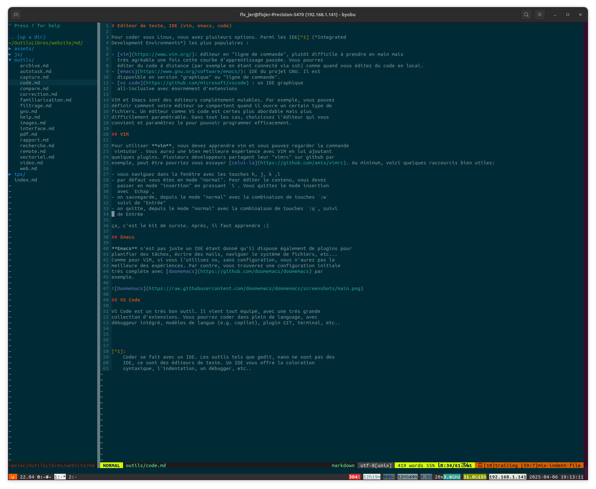
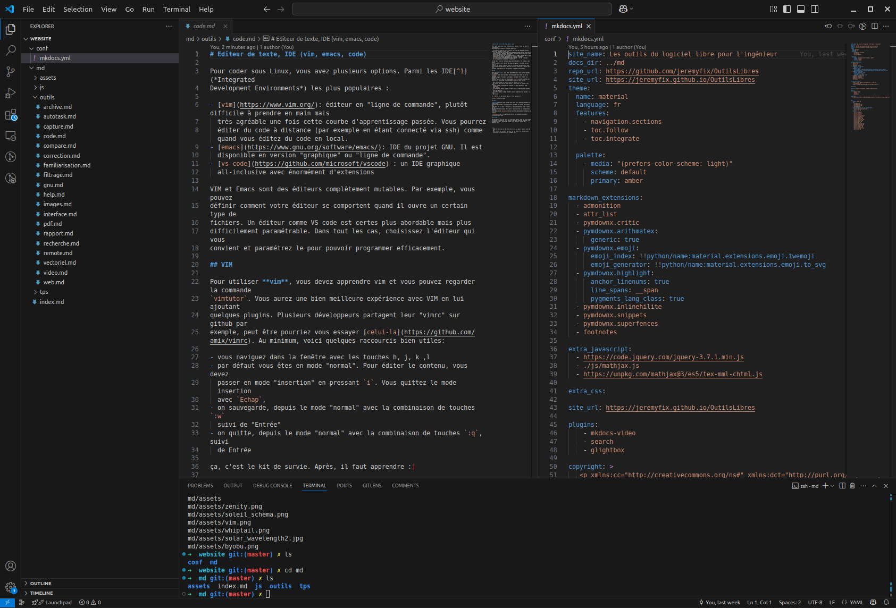

# Editeur de texte, IDE (vim, emacs, code)

Pour coder sous Linux, vous avez plusieurs options. Parmi les IDE[^1] (*Integrated
Development Environments*) les plus populaires :

- [vim](https://www.vim.org/): éditeur en "ligne de commande", plutôt difficile à prendre en main, mais très agréable une fois cette courbe d'apprentissage passée. Vous pourrez
  éditer du code à distance (par exemple en étant connecté via ssh) comme quand vous éditez du code en local.
- [emacs](https://www.gnu.org/software/emacs/): IDE du projet GNU. Il est
  disponible en version "graphique" ou "ligne de commande". 
- [vs code](https://github.com/microsoft/vscode) : un IDE graphique
  all-inclusive avec énormément d'extensions 

VIM et Emacs sont des éditeurs complètement mutables. Par exemple, vous pouvez
définir comment votre éditeur se comportent quand il ouvre un certain type de
fichiers. Un éditeur comme VS code est certes plus abordable, mais plus
difficilement paramétrable. Dans tous les cas, choisissez l'éditeur qui vous
convient et paramétrez-le pour pouvoir programmer efficacement.

## VIM

Pour utiliser **vim**, vous devez apprendre vim et vous pouvez regarder la commande
`vimtutor`. Vous aurez une bien meilleure expérience avec VIM en lui ajoutant
quelques plugins. Plusieurs développeurs partagent leur "vimrc" sur github par
exemple, peut-être pourriez vous essayer [celui-la](https://github.com/amix/vimrc). Au minimum, voici quelques raccourcis bien utiles :

- vous naviguez dans la fenêtre avec les touches h, j, k ,l
- par défaut vous êtes en mode "normal". Pour éditer le contenu, vous devez
  passer en mode "insertion" en pressant `i`. Vous quittez le mode insertion
  avec `Echap`,
- on sauvegarde, depuis le mode "normal" avec la combinaison de touches `:w`
  suivi de "Entrée"
- on quitte, depuis le mode "normal" avec la combinaison de touches `:q`, suivi
  de Entrée

ça, c'est le kit de survie. Après, il faut apprendre :)

## Emacs

**Emacs** n'est pas juste un IDE étant donné qu'il dispose également de plugins pour
planifier des tâches, écrire des mails, naviguer le système de fichiers, etc.
Comme pour VIM, si vous l'utilisez nu, sans configuration, vous n'aurez pas la
meilleure des expériences. Par contre, vous trouverez une configuration initiale
très complète avec [doomemacs](https://github.com/doomemacs/doomemacs) par
exemple.

## VS Code

VS Code est un très bon outil. Il vient tout équipé, avec une très grande
collection d'extensions. Vous pourrez coder dans plein de langage, avec
débugueur intégré, modèles de langue (e.g. copilot), plugin GIT, terminal, etc. 

[^1]: 
	Coder se fait avec un IDE. Les outils tels que gedit, nano ne sont pas des
	IDE, ce sont des éditeurs de texte. Un IDE vous offre la coloration
	syntaxique, l'indentation, un débugueur, etc.
