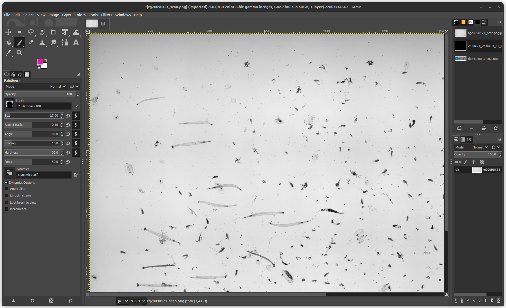

# Manipulation d'images (convert, mogrify, animate, compose, gimp)


## ImageMagick (convert, mogrify, animate, compose)

Si vous devez manipuler des images par exemple pour les convertir d'un format à un autre, pour changer leur résolution, en extraire une sous-partie, combiner des images, etc. [imagemagick](http://www.imagemagick.org/script/index.php) est un outil très
pratique. ImageMagick fournit un ensemble d'outils en ligne de commande `convert`, `mogrify`, etc. On trouvera des
exemples d'utilisation de ces outils sur la [page d'ImageMagick](http://www.imagemagick.org/Usage/). ImageMagick fournit un
ensemble d'outils (convert, mogrify, import, ...) dont on trouvera une liste à l'adresse
[http://www.imagemagick.org/script/command-line-tools.php](http://www.imagemagick.org/script/command-line-tools.php). 

**convert** permet entre autres de convertir une image d'un format en un autre, de re-dimensionner une image, d'en extraire une sous-partie, etc. On illustre quelques options de convert ci-dessous (et adapté de la documentation en ligne d'ImageMagick):

!!! example

	**Utilisation de convert (ImageMagick)**

	A partir de l'image [gnu.svg](../assets/gnu.svg) de Aurélio A. Heckert
	disponible sur la page [https://www.gnu.org/graphics/heckert_gnu.html](https://www.gnu.org/graphics/heckert_gnu.html)

	

	```bash
	$ convert gnu.svg -resize 20% gnu.png
	```

	

	```bash
	$ convert -crop 75x50+20+20 +repage gnu.png gnu-eye.png
	```
	
	

**mogrify** fonctionne comme **convert** mais peut s'appliquer sur un ensemble d'images. Cet outil est donc très pratique pour
appliquer les mêmes traitements à une grande collection d'images. On peut par exemple redimensionner et convertir un ensemble d'images JPEG en une ligne 


```bash
$ mogrify -crop 75x50+20+20 +repage -format png *.jpg
```

Les dernier outil qu'on mentionne sont **animate** qui permet d'animer une
séquence d'images[^1] et **compose** qui permet d'assembler plusieurs images en
une seule image.

Il existe également une variante, basée originalement sur une ancienne version d'imagemagick et qui évolue depuis indépendemment, qui s'appelle [graphicsmagick](http://www.graphicsmagick.org/) et qui semble avoir de meilleures performances
qu'imagemagick. 

imagemagick et graphicsmagick ont des wrappers qui permettent d'utiliser ces outils depuis différentes langages de programmation.


## GNU Image Manipulation Program (GIMP)

[](https://www.gimp.org)

On ne peut pas parler d'outils libres de traitement d'image sans mentionner l'excellent [Gimp](http://www.gimp.org/) qui vous permet de retoucher des photos, appliquer des filtres, convertir l'image d'un format en un autre, etc... 

Si vous lancez gimp, l'interface graphique se lancera par défaut. Mais vous pouvez également appeler gimp en ligne de commande, pour par exemple, appliquer un filtre à une image[^2].

Ci-dessous un exemple de GIMP chargeant une image, une très grosse image :




[^2]:
	On peut même imaginer que ce ne soit qu'un élément d'une chaîne qui capture des images, les traitent et les assemble pour former une vidéo, le tout à l'aide d'un Makefile.


[^1]:
	on verra dans la partie [video](video.md) comment fabriquer une vidéo à partir d'une série d'images.
