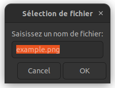
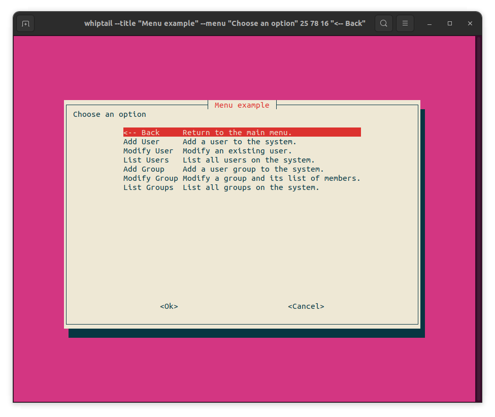

# Interface utilisateur (zenity, whiptail)

On a parfois besoin d'agrémenter un script shell avec quelques interactions avec
l'utilisateur, par exemple pour lui afficher une boîte de dialogue, lui poser
des questions, etc... 

Si vous voulez créer des interfaces utilisateur, vous avez plusieurs
possibilités qui vont dépendre du language dans lequel vous codez :

- [zenity](https://help.gnome.org/users/zenity/stable/), [whiptail]() sont disponibles en python mais également en shell
  script !
- [ncurse]() , [imgui]()
- [gtk](), [wx](), [tk]() et [Qt]() sont également disponibles dans pleins de
  langages

Ici, on ne va offrir qu'un aperçu concernant zenity/whiptail pour se focaliser
exlusivement sur des outils permettant d'interagir avec l'utilisateur depuis
un script shell (bash, zsh, ...).


Zenity est un utilitaire en ligne de commande qui permet de créer des boites de dialogue. Ces boites de dialogue peuvent contenir des calendriers, sélecteur de fichier, listes,
formulaires, messages, zones de texte, mot de passe, etc... Le principal intérêt de Zenity est qu'il est alors très facile de générer de petites interfaces graphiques, par exemple pour demander une information ou informer de l'avancement d'une tâche, sans avoir à passer par toute une moulinette de programme C++, Java, ou autre. Un exemple d'utilisation de Zenity est présenté dans la section sur les [outils de capture](capture.md) pour saisir un nom de fichier dans lequel sauvegarder une capture d'écran. 

Ci-dessous, quelques exemples que vous trouverez sur le [site web de Zenity](https://help.gnome.org/users/zenity/stable/). Zenity produit deux sorties: un code de sortie stocké dans la variable `$?` dont la valeur est $0$ si tout va bien et $1, -1$ ou $5$ dans des cas d'erreur[^1]. Ce qui est intéressant c'est que la commande elle-même retourne un résultat, par exemple le texte saisi dans une boite de dialogue, le lien vers le fichier sélectionné dans un sélecteur de fichier, etc...\\

**Pour afficher une simple zone de saisie:**

```bash
$ zenity --entry --title="Sélection de fichier" \
       --text="Saisissez un nom de fichier:" \
       --entry-text "example.png" 
```



**Pour sélectionner un ou plusieurs fichiers**, le résultat étant une liste des fichiers sélectionnés séparés par le séparateur précisé (`|` pour l'exemple):

```bash
$ zenity --file-selection --title="Sélection de fichier" --separator="|" --multiple
```

On peut faire de même avec whiptail. Whiptail est l'outil que l'on va plutôt
trouver classiquement sur les distributions dérivées de debian. C'est l'outil
utilisé pour créer l'interface graphique de raspiconfig, l'utilitaire pour
configurer un raspberry. Pour le coup, vous trouverez plusieurs utilisations de
whiptail dans le [code source de raspi-config](https://github.com/RPi-Distro/raspi-config/blob/bookworm/raspi-config).

**Afficher un message**

```
$ whiptail --msgbox "Incroyable cet outil ! " 10 30
```

**Poser une question oui/non**
```bash
$ whiptail --yesno "Êtes-vous vraiment vraiment sûr de vouloir poursuivre ? " 20 60 2 --yes-button "Carrément" --no-button "Pitié non"
```

**Menu**

```bash
whiptail --title "Menu example" --menu "Choose an option" 25 78 16 \
"<-- Back" "Return to the main menu." \
"Add User" "Add a user to the system." \
"Modify User" "Modify an existing user." \
"List Users" "List all users on the system." \
"Add Group" "Add a user group to the system." \
"Modify Group" "Modify a group and its list of members." \
"List Groups" "List all groups on the system."
```



Ce dernier exemple est tiré de la page wikibooks sur whiptail sur laquelle vous
trouverez plein d'autres exemples. Allez voir [https://en.wikibooks.org/wiki/Bash_Shell_Scripting/Whiptail](https://en.wikibooks.org/wiki/Bash_Shell_Scripting/Whiptail).

Voir aussi :

- [Bash Shell Scripting / Whiptail sur Wikibooks](https://en.wikibooks.org/wiki/Bash_Shell_Scripting/Whiptail)

[^1]: 
	Regardez la page de Zenity pour la signification de ces codes d'erreur.  [https://help.gnome.org/users/zenity/stable/usage.html.en](https://help.gnome.org/users/zenity/stable/usage.html.en)
