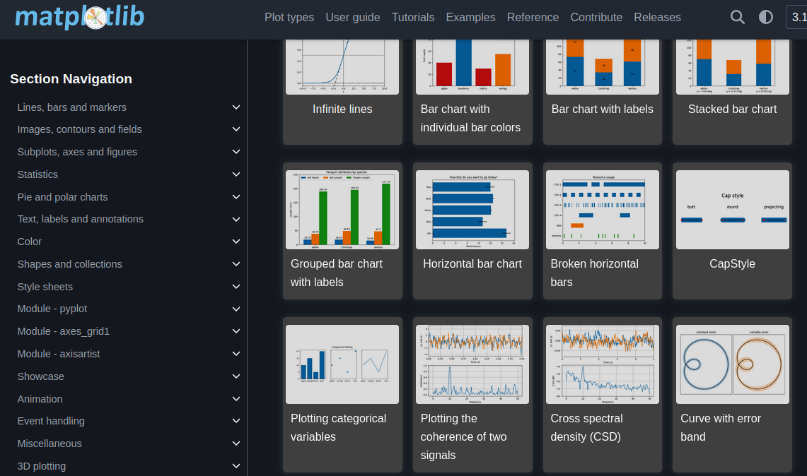
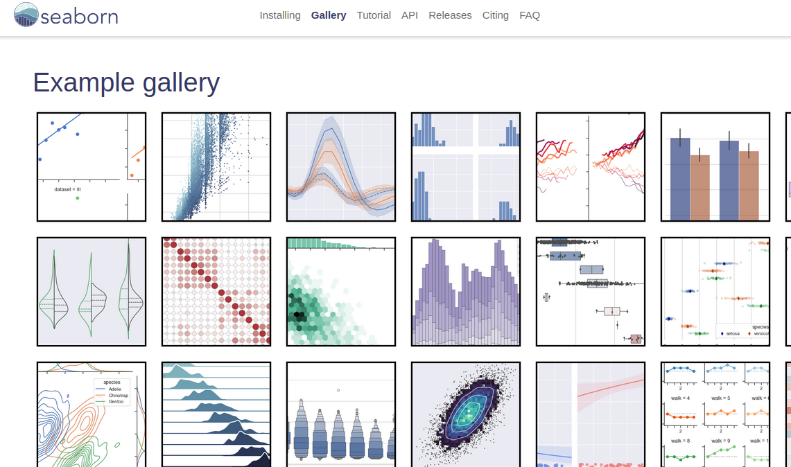
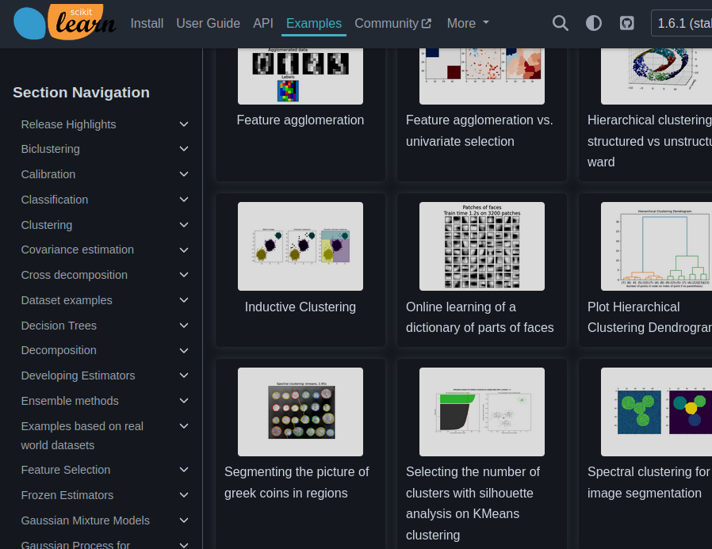
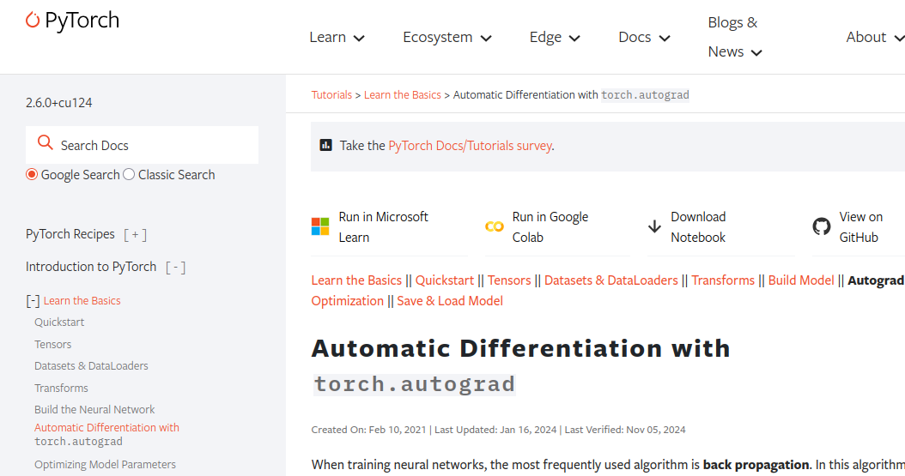

# Calculs numériques et symboliques (octave, scilab, numpy, pandas, scipy, sympy, matplotlib, seaborn)

## Alternatives à Matlab (Octave, scilab, SageMath) 

Plusieurs logiciels libres existent en alternatives à Matlab. Quelques-uns sont
listés ci-dessous :

- [GNU Octave](https://octave.org), projet GNU 
- [scilab](https://gitlab.com/scilab/scilab), porté par Dassault Systèmes
- [SageMath](https://www.sagemath.org/index.html)

Octave [utilise le même langage que Matlab](https://en.wikipedia.org/wiki/GNU_Octave#MATLAB_compatibility) de telle manière qu'un programme écrit
en Matlab devrait être exécutable avec Octave. Il est extensible avec des
[packages](https://packages.octave.org/).

Scilab est un outil de calcul porté par Dassault Systèmes. Il peut également
être étendu avec [des boîtes à outils installables avec atoms](https://atoms.scilab.org/), par exemple pour [la mécanisque spatiale par le CNES](https://atoms.scilab.org/toolboxes/celestlab/).

SageMath est un outil pour les mathématiques, pour le calcul numérique, le
calcul symbolique, le tracé, etc... On trouvera plus d'informations dans le
livre en Français [Calcul mathématique avec Sage](https://www.sagemath.org/sagebook/french.html).

## Outils python du calcul scientifique

Dans l'écosystème python, plusieurs librairies pour le calcul scientifique sont incontournables :

- [numpy](https://numpy.org) : calcul numérique en général
- [scipy](https://scipy.org/) : traitement du signal
- [sympy](https://www.sympy.org) : calcul symbolique
- [matplotlib](https://matplotlib.org/) : tracé
- [seaborn](https://seaborn.pydata.org/) : tracé.


### Calcul numérique (numpy, scipy)

La librairie numpy est un incontournable pour le calcul numérique en python.
Avec un coeur écrit en C++ et un wrapper python, elle est à la foi efficace et
confortable d'utilisation. Vous trouverez des guides sur la page [https://numpy.org/learn/](https://numpy.org/learn/) pour prendre en main numpy. Il existe également des livres en accès libre comme [From python to numpy](https://github.com/rougier/scientific-visualization-book).

Pour l'utiliser :

```bash
$ python3 -m pip install numpy
```

### Traitement des images (scikit-image, opencv)

Pour le traitement des images, des librairies standards comme OpenCV ou
scikit-image vous offrent un certain nombre d'algorithmes :

- [scikit-image](https://scikit-image.org/)
- [opencv](https://opencv.org/)

La librairie OpenCV en particulier est en partculier très développée avec des
algorithmes de calibration de caméra, détection de ligne (transformée de Hough,
opérateurs morphologiques, ...) . Pour 
l'utiliser en python, vous pouvez l'installer avec pip :

```bash
$ python3 -m pip install opencv-python-headless
```


### Calcul symbolique (sympy)

[sympy](https://www.sympy.org) est une librairie python qui va vous permettre de manipuler symboliquement des expressions mathématiques. Pour l'installer :

```bash
$ python3 -m pip install sympy
```

Par exemple, considérons deux référentiels A et B, l'orientation du référentiel
B dans le référentiel A étant donnée par le quaternion ($q_x, q_y, q_z, q_w)$.
On peut calculer symboliquement les coordonnées, dans le référentiel A, du vecteur $(1, 0, 0)$ dans le référentiel B, projeté sur le plan x-y du référentiel A à l'aide de sympy :

```python
import sympy
from sympy.algebras.quaternion import Quaternion
from sympy import symbols
from sympy import conjugate

qx = symbols('qx')
qy = symbols('qy')
qz = symbols('qz')
qw = symbols('qw')

q1 = Quaternion(qw, qx, qy, qz, real_field=True)

# Vecteur x dans le référentiel B
v = Quaternion(0, 1, 0, 0)

res = q1 * v * conjugate(q1)
print(f"Après rotation : {res}"))

horizontal_res = Quaternion(res.a, res.b, res.c, 0.0).normalize().simplify()
print(f"Vecteur projeté normalisé : {horizontal_res}")
```

### Tracé (matplotlib, seaborn)

Pour tracé des données avec un programme python, vous pouvez utiliser les
librairies [matplotlib](https://matplotlib.org/) et [seaborn](https://seaborn.pydata.org/).

{width=40%}
{width=40%}

Pour apprendre à prendre en main ces libraiires, il existe des [tutoriels pour
matplotlib](https://matplotlib.org/stable/tutorials/index.html) et des
[tutoriels pour seaborn](https://seaborn.pydata.org/tutorial.html).

### Machine learning (scikit-learn, pandas, pytorch, tensorflow)

Les librairies pour l'apprentissage automatique sont nombreuses. On atteint
probablement les limites de l'objectif de ce site web en ne pouvant pas lister
toutes les librairies pertinentes pour ce sujet. Mais disons qu'on peut donner
quelques pointeurs :

- [scikit-learn](https://scikit-learn.org) : proposent des implémentations de
  beaucoup d'algorithmes d'apprentissage automatique (arbres, svm, réseaux de
  neurones, k-means, ...), de datasets, etc..
- [pandas](https://pandas.pydata.org) : librairie particulièrement efficace pour
  traiter de grandes masses de données (en "local", vs hadoop/spark pour des traitements distribués)
- [pytorch](https://pytorch.org) et  [tensorflow](https://tensorflow.org) : pour
  le deep learning
- [jax](https://docs.jax.dev/en/latest/) qui est apparu dans le sillage des
  librairies de deeplearning, que l'on pourrait définir comme un numpy qui peut
  exécuter ses calculs sur CPU/GPU/TPU, et avec la différentiabilité des opérations

{width=40%}
{width=50%}

