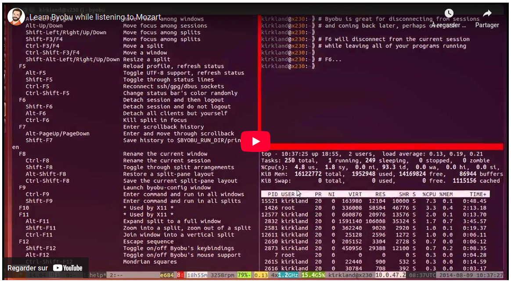

# Interaction avec une machine distante (ssh, scp, rsync, sshfs, screen, byobu)

Vous allez très certainement être confrontés à interagir avec des machines à
distance, parfois même des serveurs qui ne disposent pas de clavier/souris. Les
commandes présentées dans ce chapitre vous montrent comment :

- vous connecter à distance à une machine voir, exécuter des commandes à
  distance (`ssh`)
- transférer des fichiers vers ou depuis une machine distante (`scp`, `rsync`)
- "monter" un volume distant pour y accéder localement (`sshfs`)


## Se connecter à une machine distante (ssh)

Quand on a besoin de se connecter à une machine distante, si celle-ci est
équipée d'un serveur ssh, on peut utiliser la commande `ssh` en ligne de
commande  :

```
$ ssh monlogin@ip_de_la_machine
```

et votre terminal se retrouve connecté au serveur dont l'adresse IP est
`ip_de_la_machine`. Si jamais le serveur ssh de la machine distante n'écoute pas
sur le port standard $22$, on peut l'indiquer par l'option `-p port`.

Il est plutôt confortable de se définir des alias ssh. Ils sont définis dans le
fichier `~/.ssh/config`.

Par exemple, si vous mettez le contenu ci-dessous :

```
Host raspi
	Hostname 82.99.234.239
	User monlogin
	Port 2222
```

Il vous permet de lancer la commande `ssh raspi` qui correspond à `ssh
monlogin@82.99.234.239 -p 2222`.

Parfois, on a besoin de passer par une machine rebond (e.g. firewall) avant
d'arriver sur la machine cible. On peut facilement le définir en ligne de
commande bien sûr mais c'est plus confortable de le définir dans son
`~/.ssh/config`. Par exemple si on veut atteindre `host1` en rebondissant sur la
machine `proxy1.domain.com`

```
Host host1
	Hostname host1
	User monlogin_sur_host1
	ProxyCommand ssh proxy1 -W %h:%p

Host proxy1
	Hostname proxy1.domain.com
	User monlogin_sur_proxy1
```

et vous pourrez alors simplement lancer la commande `ssh host1` depuis votre
machine locale ! 

## Exécuter des commandes à distance (ssh)

Avec la commande `ssh` vous pouvez vous connecter sur un hôte distant, mais vous
pouvez aussi directement exécuter une commande sur cet hôte. Par exemple :

```
$ ssh host1 "df -h"
```

## Transférer des fichiers ou depuis une machine distante (scp, rsync)

Si vous voulez copier des fichiers/répertoires de votre machine locale à une
machine distante l'inverse, il existe plusieurs commandes comme `scp` ou
`rsync`. La commande `rsync` ne va copier que ce qui est nécessaire, en
comparant l'arborescence locale et distante lors de la copie d'un répertoire.

Par exemple, quelques appels :

**Copier un fichier local sur une machine distante**

```
$ scp /chemin/vers/rep/local/fichier monlogin@monhote:/chemin/vers/rep/
$ rsync -ah --info=progress2 /chemin/vers/rep/fichier monlogin@monhote:/chemin/vers/rep/
```

**Copier un répertoire local sur une machine distante**

```
$ scp -r /chemin/vers/rep/local monlogin@monhote:/chemin/vers/rep/
$ rsync -ah --info=progress2 /chemin/vers/rep/local/ monlogin@monhote:/chemin/vers/rep/dist
```

Voir aussi [How to copy and transfer files remotely on Linux using scp and rsync](https://www.cyberciti.biz/faq/how-to-copy-and-transfer-files-remotely-on-linux-using-scp-and-rsync/)

## Monter un volume distant (mount, sshfs)

Si vous voulez interragir avec un répertoire sur une machine distant, il est
possible de le "monter" localement et de voir ce répertoire comme si c'était
un espace disque sur votre machine locale.

De manière générale, il existe plusieurs manière de monter des volumes, qui
dépendent des protocoles d'échange avec le serveur qui contient les données. La
commande `mount` par exemple, gère les protocoles nfs, cifs, etc..

```
$ mkdir /point/de/montage/local
$ mount --types filesystem_type monlogin@monhote:/chemin/distant /point/de/montage/local
```

Si le serveur distant est équipé d'un serveur ssh, vous pouvez également
utiliser un montage par ssh avec la commande `sshfs` :

```
$ mkdir /point/de/montage/local
$ sshfs monlogin@monhote:/chemin/distant /point/de/montage/locak
```

Voir aussi [How To Mount a Remote Directory With SSHFS on a Linux](https://www.cyberciti.biz/faq/how-to-mount-remote-directory-filesystems-with-sshfs-on-linux/)

## Authentification alternative au mot de passe, par clé ssh (ssh-keygen, ssh-copy-id)

Il existe plusieurs mécanismes grâce auxquels un hôte distant peut vous
identifier :

- par mot de passe que seul vous et l'hôte distant connaissent
- par clé ssh, chiffrement dit à clé symétrique dans lequel vous et l'hôte
  possédaient chacun un bout de clé

Et certainement d'autres. Maintenant, également complété par des mécanismes de
2FA (two-factor authentication) par lequel un utilisateur doit apporter une
preuve complémentaire de son identité par un code partagé par exemple.

En ce qui concerne l'authentification par clé ssh, le principe est de générer
une paire de clé, dites "clé publique", "clé privée". Ces clés sont symmétriques
et, en théorie, interchangeables. On les appelle "public", "privé" et elles
possèdent des extensions et contenus différents pour éviter que l'utilisateur ne
partage par erreur parfois la clé publique, parfois la clé privée; Si quelqu'un
possède les deux morceaux de la clé (plus éventuellement un mot de passe), il
peut se faire passer pour vous. 

Pour générer une paire de clé :

```bash
$ ssh-keygen
```

Plusieurs options peuvent être changées comme le type de clé, la longueur de la
clé, etc..  Cette commande va produire $2$ fichiers, l'un pour la clé publique,
l'autre pour la clé privée. Pour une clé de type RSA, ces fichiers seront
`~/.ssh/id_rsa` pour la clé privée et `~/.ssh/id_rsa.pub` pour la clé publique.

La clé privée doit rester ... privée. La clé publique peut être partagée sans
soucis avec tout les serveurs sur lesquels vous avez besoin de vous
authentifier : serveur ssh distant, instances gitlab, github.com, etc...

Pour copier une clé sur un serveur distant, il existe la commande `ssh-copy-id`

```bash
$ ssh-copy-id monlogin@monhote
```

Vous pouvez alors lancer la commande `ssh` qui devrait utiliser votre clé ssh
pour vous authentifier :

```bash
$ ssh monlogin@monhote
```

Lors de l'utilisation de votre clé SSH, un "agent ssh", un programme qui tourne
en local sur votre machine, va dévérouiller votre clé en vous demandant son mot
de passe avant de l'utiliser; Pour les connexions ultérieures, cet agent ssh se
souviendra des identités dévérouillées.

En pratique, la commande `ssh-copy-id` va simplement copier le contenu de votre clé
publique dans le fichier `~/.ssh/authorized_keys` du serveur. N'hésitez pas à
aller inspecter le contenu de ce fichier pour voir les clé qui y sont déjà
renseignées :

```bash
$ ssh monlogin@monhote "cat ~/.ssh/authorized_keys"
```

Si vous utilisez des clé ssh pour vous connecter sur des machines distantes,
éventuellement en utilisant des rebonds, il peut être pratique de partager
"l'agent ssh". On peut alors l'indiquer dans son fichier `~/.ssh/config` avec
l'option `ForwardAgent` :

```
Host raspi
	Hostname ww.xx.yy.zz
	User monlogin
	ForwardAgent yes
```

Voir aussi [How To Set up SSH Keys on a Linux / Unix System](https://www.cyberciti.biz/faq/how-to-set-up-ssh-keys-on-linux-unix/)

## Multiplexeur de terminal (screen, tmux, byobu)

Un multiplexeur de terminal vous permet de :

- virtuellement disposer de plusieurs fenêtres de terminal dans une même fenêtre. Cela s'avère extrêmement pratique en
particulier lorsque vous interragissez avec une machine à distance,
- laisser un processus vivant, même si on est déconnecté d'une machine distante

Il existe plusieurs programmes pour ça, comme `screen`, `tmux` ou encore
`byobu`.

La commande `screen` est utile lorsque vous vous connectez par ssh sur une
machine distante et que vous souhaitez conserver une session active même après
vous être déconnecté de l'hôte. 


```bash
$ ssh monlogin@monhote

# Créer une nouvelle session
$ screen

# Lancer des commandes
....

# Se détacher de la session
<Ctrl+A> <d>
```

La séquence de touches <Ctrl+A> <d> permet de vous "détacher" de la session.
Vous pouvez alors fermer la session ssh, la session screen reste active sur
l'hôte. Plus tard, pour vous ré-attacher à la session :

```
# Lister les sessions actives pour identifier
# le nom de la session à laquelle se réattacher
$ screen -ls

# Se réattacher à une session
$ screen -r <nom-de-session>
```

Une autre commande très utile est `byobu`. Vous pouvez détacher/ré-attacher des
sessions comme pour screen. Comme pour screen, vous pouvez créer plusieurs
fenêtres mais l'interface est peut être un peu plus ergonome. Vous créez et
naviguez parmi les onglets avec les touches <F2>, <F3>, <F4>.

[](https://www.byobu.org/home)

