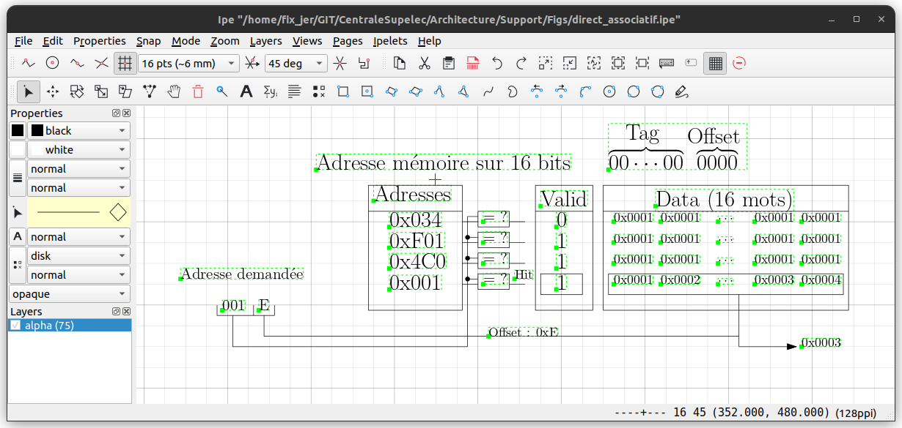
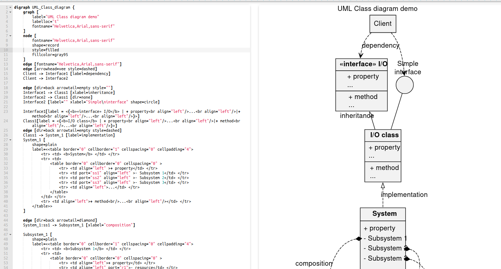

# Dessin vectoriel (xfig, inkscape, ipe, graphviz)

!!! warning

	wip

Le dessin vectoriel présente l'avantage d'être, justement, vectoriel, c'est à dire décrit par un ensemble de directives du type : tracer une ligne entre les points A et B, remplir la zone de la couleur c, .... Cela conduit à des dessins qui ne souffre pas d'un passage à l'échelle contrairement à des images qui sont définies par une collection de pixel d'une certaine couleur, ce qu'on appelle des images matricielles (*raster graphics*). 

Il existe plusieurs logiciels qui permettent de réaliser des dessins vectoriels et je vous en cite trois que je trouve assez pratique :

- xfig : l'interface est un peu vieillote mais le logiciel reste assez efficace pour générer de belles figures. Les figures avec l'extension ".fig" sont d'ailleurs générables facilement depuis un programme puisqu'ils contiennent des descriptions ascii des figures. L'export vers des formats EPS ou PDF se fait grâce à l'outil fig2dev. On peut inclure des formules Latex même si ce n'est pas complètement immédiat
- inkscape : très facile d'utilisation et très pratique
- ipe : encore mieux je trouve si vous voulez générer des images vectorielles avec des formules Latex
- dot: language descriptif de diagrammes pour lequel différents outils `dot`,
  `neato`, ... permettent de générer des images.

## Xfig

[xfig](https://mcj.sourceforge.net/) est un outil de dessin vectoriel qui est
déjà très ancien, première release en 1985 et qui s'avère encore très pratique.

L'interface va paraître un peu vieillote :)

Quelques éléments sur xfig :

- interface assez simple mais qui permet de réaliser des dessins de base : tracé
  de lignes ou autres figures géométriques, couper des lignes et ajouter des
  points, dessiner du texte, des flêches, remplir des formes, etc...
- on peut scripter la production de figures xfig !! Un fichier xfig est un
  fichier texte ASCII. Allez voir la [description du format dans la
  documentation](https://mcj.sourceforge.net/fig-format.html)
- on peut convertir un fichier xfig en image vectorielle SVG/PDF/EPS/... en
  utilisant [fig2dev](https://sourceforge.net/p/mcj/fig2dev/ci/master/tree/).
- on peut inclure des formules de Math en LaTeX.

## IPE

[ipe](https://github.com/otfried/ipe) est un petit outil à la xfig qui vous permet de réaliser des diagrames assez
facilement. L'objectif d'IPE est de vous aider à construire des images à
intégrer dans des documents LaTeX.

Vous pouvez même l'utiliser dans votre navigateur en allant sur la page [https://ipe-web.otfried.org/index.html](https://ipe-web.otfried.org/index.html).

## Inkscape

Avec [inkscape](https://inkscape.org/fr/), on est un outil beaucoup plus riche
et complet que xfig.

Pour le coup, forcément, il y a un peu plus d'apprentissage et vous trouverez
des [didacticiels en ligne](https://inkscape.org/fr/apprendre/).

## Diagrammes avec graphviz

Les [outils de graphviz](https://www.graphviz.org/) sont constitués du langage dot et des outils en ligne de
commande `dot`, `neato`, `circo`, ...

Le langage dot est un langage de description de diagramme dans lequel vous
définissez les noeuds, les arêtes, etc.. mais vous soucier du placement. Les outils `dot`,
`netao`, etc... permettent de générer un dessin vectoriel à partir de cette
description. La raison d'avoir plusieurs outils de génération d'images vient du
fait qu'il n'y a pas une solution unique pour placer automatiquement les
éléments d'un diagramme à partir de sa description et ces outils vont faire
différentes hypothèses.

Notez au passage que, comme pour xfig, le format de `graphviz` est un format texte
relativement simple qu'il est possible de générer depuis du code !

Plusieurs exemples sont fournis sur la page [https://www.graphviz.org/gallery/](https://www.graphviz.org/gallery/) et vous pouvez même tester en ligne depuis [https://magjac.com/graphviz-visual-editor/](https://magjac.com/graphviz-visual-editor/). L'exemple de diagramme UML, proposé par Costa Shukyupin est représenté ci-dessous à côté de sa version dot.

