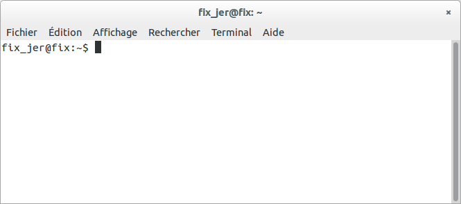
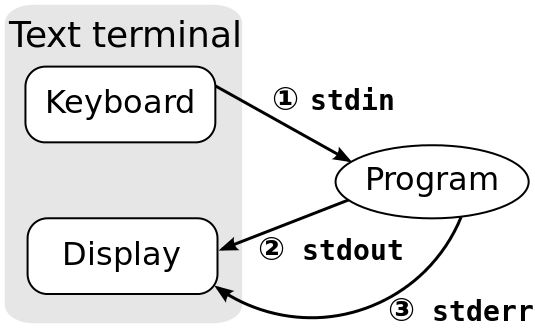

# Bash à sable

Le but de ce TP d'introduction est de se familiariser avec l'environnement Unix Ubuntu et de voir quelques outils, notamment `bash`, que vous utiliserez par la suite dans les TPs. Nous allons voir comment :

- créer/supprimer des fichiers/répertoires (éventuellement récursivement)
- écrire un script bash pour manipuler des fichiers, changer leurs droits
- rechercher/installer des packages
- ...

Nous allons voir quelques commandes dans ce TP mais il existe des serious games,
en ligne, qui vous apprennent à prendre en main le shell, des ressources que je
tire de ce post de LinuxFr : [https://linuxfr.org/users/ckiller/journaux/new-skills-linux](https://linuxfr.org/users/ckiller/journaux/new-skills-linux):

- [GameShell](https://github.com/phyver/GameShell/) : `wget https://github.com/phyver/GameShell/releases/download/latest/gameshell.sh && bash gameshell.sh`
- [OverTheWire](https://overthewire.org/wargames/)
- [SadServers](https://sadservers.com/scenarios) : pour des techniques plus
  avancées

## Prise en main

Pendant tous les TPs, nous allons utiliser deux outils : la console (ou terminal) et l'éditeur `emacs`. Les scripts seront exécutés depuis un terminal et écrits avec `emacs`.

Sous Gnome 3, pour afficher la liste des applications disponibles, déplacez le curseur de la souris dans le coin en haut à gauche de l’écran ou appuyez sur la touche Windows. Tapez « Terminal » puis cliquez sur l'application correspondante.

C’est dans ce terminal que nous allons exécuter nos scripts, créer des répertoires, etc.



Pourquoi passer par le terminal ? Je vous l'accorde, à première vue, l'interface
est austère. Le terminal est une interface pour interagir avec le shell. Bash
est un shell, un langage de programmation qui va vous offrir énormément de
flexibilité dans la construction de commandes personnalisées. Grâce au Bash,
vous pouvez combiner des commandes simples pour construire un programme plus
compliqué. Pour l'instant, cela reste abstrait, mais plusieurs exemples ci-après
vont l'illustrer. Faites-moi confiance.

Si vous vous posez des questions sur une commande, peut-être que le site [https://explainshell.com](https://explainshell.com) pourrait vous être utile. Regardez par exemple ce qu'il propose sur la commande [`ls -p | grep -v / | wc -l`](https://explainshell.com/explain?cmd=ls+-p+%7C+grep++-v+%2F+%7C+wc+-l)

## Navigation dans le système de fichiers

Quelques commandes de base à connaître :

- `ls` : lister le contenu du répertoire courant
- `ls /chemin/vers/un/repertoire` : lister un répertoire spécifique
- `pwd` : afficher le chemin du répertoire courant
- `cd` : changer de répertoire (`cd ..`, `cd ~`)
- `mkdir` : créer un répertoire (`-p` pour hiérarchique)
- `rm` : supprimer un fichier (`-r` pour un répertoire)

!!! question

	**Créez un répertoire dans votre home (`cd ~`) pour y stocker vos scripts.**

## Rechercher/Installer des packages

Linux permet d’installer facilement des logiciels via un gestionnaire de paquets :

- Sous Fedora :

	- `dnf search` : chercher un paquet
	- `dnf install` : installer
	- `dnf remove` : désinstaller

- Sous Ubuntu:

	- `apt search` :
	- `apt install` : installer
	- `apt remove` : désinstaller

L'installation par le gestionnaire de paquet est à privilégier puisqu'il va
prendre en charger l'installation des dépendances notamment.

Les installations nécessitent les [droits superutilisateur](../outils/familiarisation.md#permissions) car elles modifient des dossiers système comme `/usr/lib`, `/usr/bin`, etc.

## Éditer avec Emacs

`emacs` est un éditeur de texte (un IDE même, voir [les IDE](../outils/code.md)) très complet et configurable. Il offre :

- coloration syntaxique
- indentation
- modes spécifiques selon l’extension (.py, .cpp, .sh, .tex, etc)

!!! question

	Lancez ces commandes pour tester les modes :
	```bash
	emacs titi.py &
	emacs titi.cpp &
	emacs titi.sh &
	emacs titi.tex &
	```


!!! note

	Utilisez `&` pour exécuter une commande en tâche de fond. Sans `&`, utilisez `Ctrl+Z` puis `bg`.

## Bashons un peu

Le but est d'écrire de petits scripts et les assembler avec Bash.

!!! question

	Lisez, exécutez, expérimentez avec les différents scripts Bash ci-dessous.
	Pour chaque script, vous pouvez le coder en utilisant emacs ou VS code et
	l'exécuter en suivant les instructions.

### Mon premier script bash

Fichier `hello.sh` :

```bash
#!/bin/bash

echo "hello world!"
```

Exécution :
```bash
sh hello.sh
```

Puis :
```bash
chmod u+x hello.sh
./hello.sh
```

La ligne `#!/bin/bash` indique l’interpréteur à utiliser pour évaluer le script.
C'est ce qu'on appelle le [shebang](https://fr.wikipedia.org/wiki/Shebang).

### Passer des arguments à un script bash

```bash
#!/bin/bash

echo "J'ai reçu $# arguments"

if [ $# != 0 ]; then
    echo "Liste des arguments :"
    for i in $@; do
        echo "$i"
    done
else
    echo "donc rien à lister"
fi
```

### Fonctions utiles

```bash
#!/bin/bash

echo "Je m'exécute depuis le répertoire `pwd`"
echo "Le script $0 s'appelle `basename $0` et se trouve dans `dirname $0`"
```

## Entrées et sorties standards

Une commande peut écrire sur :

- `stdout` : sortie standard
- `stderr` : sortie d’erreur
- et recevoir via `stdin` : entrée standard



## Enchaîner des scripts : filtres et pipe

Un pipe (`|`) connecte la sortie standard d’une commande à l’entrée standard d’une autre.

Exemples :
```bash
du * | sort -n
du * | sort -n | tail -10
ls -p | grep -v / | wc -l
```

Consultez `man ls`, `man grep`, `man wc` pour les détails.

## Lire l'entrée standard dans un script

Fichier `read_input.sh` :
```bash
#!/bin/bash
while read -r ligne; do
    echo "Ligne lue : $ligne"
done
```

Test :
```bash
cat read_input.sh | ./read_input.sh
```

## Aide sur les commandes

Utilisez `man` pour consulter l’aide :
```bash
man mkdir
```
Utilisez les flèches pour naviguer et `q` pour quitter.

Il existe plusieurs manières d'avoir [de l'aide sur les
commandes](../outils/help.md)
