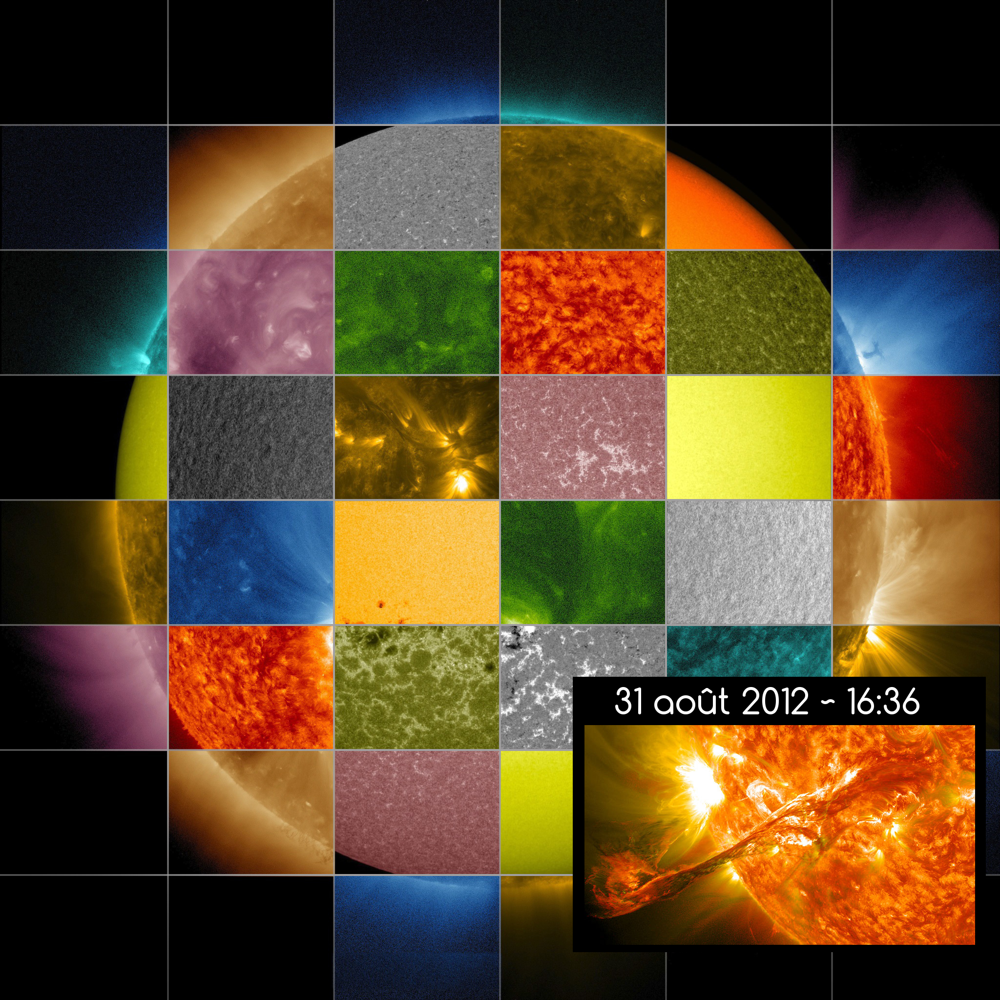
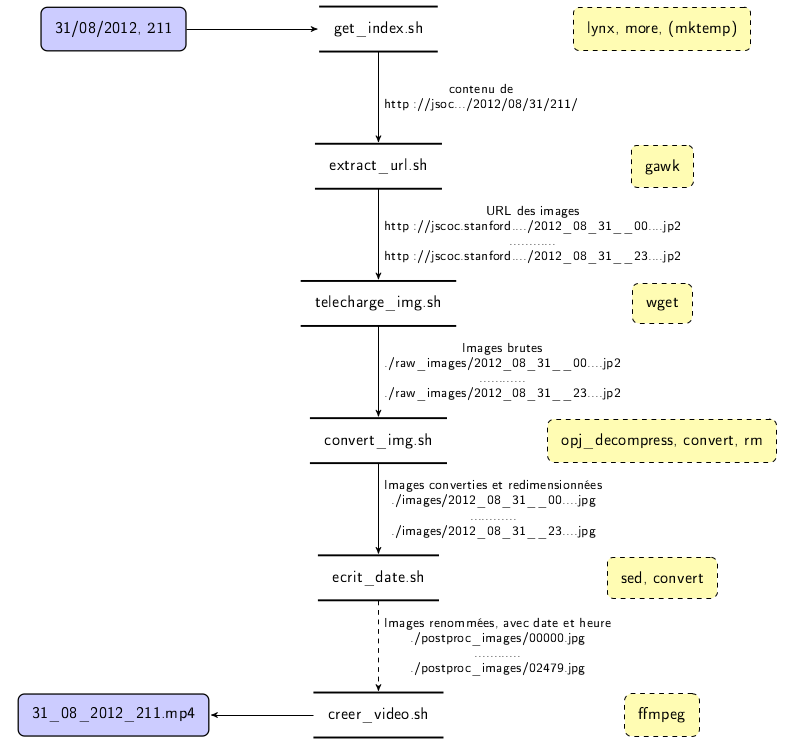
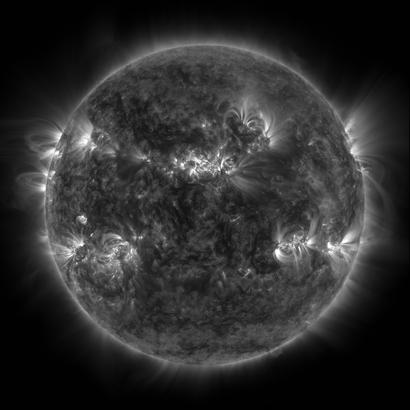
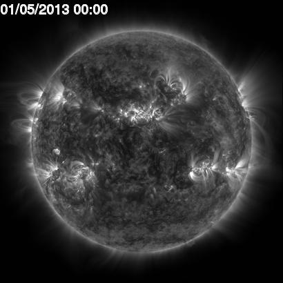
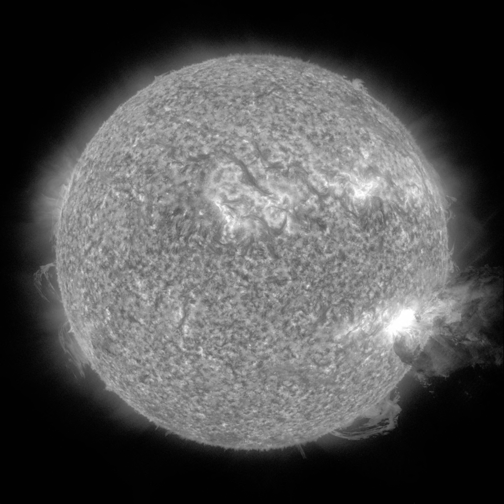
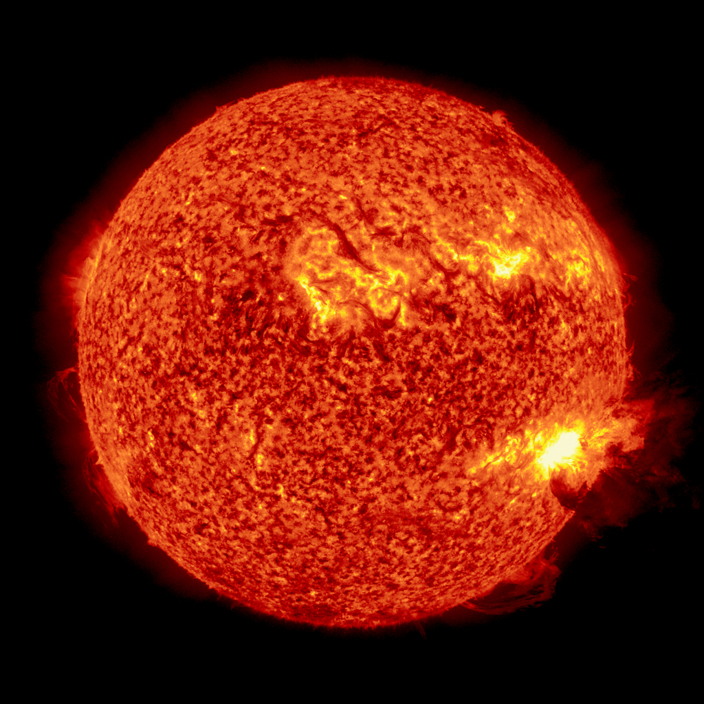

# TP : Eruption solaire et transit de Mercure, à partir des données AIA SDO

!!! danger

	miroir local


{width=50%}

<iframe width="560" height="315" src="https://www.youtube.com/embed/tagmYHJ5Wxk?si=9LR8yAYgU-gOm_GH" title="YouTube video player" frameborder="0" allow="accelerometer; autoplay; clipboard-write; encrypted-media; gyroscope; picture-in-picture; web-share" referrerpolicy="strict-origin-when-cross-origin" allowfullscreen></iframe>

## Introduction

Le but de ce TP est de construire une vidéo à partir de données collectées sur le soleil par le [Solar Dynamics Observatory](http://aia.lmsal.com/index.htm). On utilisera uniquement les images du soleil capturées à intervalles réguliers. Les images sont disponibles à l'adresse [http://jsoc.stanford.edu/data/aia/images/](http://jsoc.stanford.edu/data/aia/images/). Elles sont classées par date de mesure, la structure du répertoire distant étant :

> http://jsoc.stanford.edu/data/aia/images/YYYY/MM/DD/$\lambda$/fichier.jp2

Le SDO observe le soleil dans différentes longueurs d’onde $\lambda \in [94, 131, 171 , 193, 211, 304, 335, 1600, 1700, 4500]$Å (angstroms). Pour avoir une idée des mesures à ces différentes longueurs d’onde, vous pouvez vous rendre à l’adresse [http://sdo.gsfc.nasa.gov/data/](http://sdo.gsfc.nasa.gov/data/), ou bien regarder l’image en haut de la page.

Durant ce TP, je vous propose d'utiliser les mesures à $211$Å. Les images sont au format JPEG2000 avec l'extension $jp2$ et une résolution de $4096 \times 4096$. Dans ce TP, on cherche à illustrer la construction de programmes du type ``puits | commande1 | commande2 ....''. On va :

- récupérer les images, 
- les convertir en JPEG, 
- les redimensionner, 
- y incruster la date et l'heure de la mesure et 
- les combiner pour construire une vidéo. 

On va voir dans ce TP l'utilisation d'un certain nombre de programmes tels que `bash`, `lynx`, `wget`, `convert` (imagemagick), `gawk`, `sed` et `ffmpeg`. On cherche ainsi à ne pas réinventer la roue, votre problème est de produire une vidéo à partir des images brutes et on va voir qu'en assemblant plusieurs briques déjà existantes, on peut facilement résoudre ce problème.

!!! warning


	**Attention**: Lors de la mise en place du TP, il peut être intéressant d'utiliser un miroir local en ne récupérant par example que les images de quelques éruptions solaires, à savoir:

	- le 07/06/2011 en $304$Å : grosse éruption entre 6h et 7h
	- le 31/08/2012 en $211$Å et $171$Å : petite éruption autour de 19h
	- le 09/05/2016, Mercure transite entre le soleil et la terre vers 11h30

	Il y a plusieurs raisons à l'utilisation de ce miroir local: 
	
	1. les temps d'accès, 
	1. je crains que si tout le monde accède de manière répétée au site jsoc.stanford.edu, nous soyons banis de leur serveur web et donc qu'on ne puisse pas faire correctement le TP, 
	1. on ne surcharge pas inutilement leurs serveurs pour nos TPs.

	Nous allons pour le coup utiliser un miroir local. Demandez moi l'URL ! Dans toute la suite du sujet, il faudra bien penser à remplacer jsoc.stanford.edu par l'adresse vers le serveur infomob.

## Structure du projet

Je vous propose de créer quelques répertoires pour structurer votre projet. Pour les créer, forcez-vous à utiliser les commandes `mkdir`, `ls`, etc. depuis un terminal.

- scripts : contiendra la plupart des scripts que vous écrirez,
- raw_images : contiendra de manière temporaire les images brutes au format .jp2,
- images: contiendra les images converties au format jpeg et redimensionnées,
- postproc_images: contiendra les images jpeg dans lesquelles la date et l'heure auront été incrustées
- video : contiendra les vidéos générées

La figure ci-dessous donne une vision d'ensemble du programme que nous allons écrire.



## Récupération des données d'une journée

Le but de cette partie est d'écrire un script Bash qui se charge de récupérer les images d'une journée. Ce script prendra 4 arguments, à savoir :

- l'année YYYY, 
- le mois MM, 
- le jour DD et 
- la longueur d'onde $\lambda$ des mesures. 

Il devra produire en sortie le flux des URLs des images de cette journée particulière à la longueur d'onde $\lambda$.

Si vous allez sur le site [http://jsoc.stanford.edu/data/aia/images](http://jsoc.stanford.edu/data/aia/images), et regardez les images du 31 août 2012, vous constaterez qu'il y a énormément d'images, prises à des heures régulières, mais dont on ne peut pas facilement prédire le nom de fichier. 

On va donc procéder différemment : on va lister l'ensemble des images disponibles dans le répertoire du 31 août 2012 à $211$Å. Pour cela, on va utiliser l'explorateur `lynx` (n'hésitez pas à appeler man lynx pour en savoir plus). `lynx` est un explorateur internet textuel, sans fenêtre graphique, qui s'affiche dans la console 😱.

!!! question

	Lancez lynx, décortiquez l'interface pour effectuer une recherche sur un
	moteur de recherche 

Je suis d’accord avec vous, cette manière d’explorer internet n’est pas très confortable. Mais, on peut utiliser lynx pour récupérer le contenu d’une page grâce à l’option dump `lynx -dump URL`. En ajoutant l’option `-listonly`, on ne récupère que la liste des références (les liens vers les images dans notre cas). Essayez la commande ci-dessous :

```bash
lynx -dump -listonly http://jsoc.stanford.edu/data/aia/images/2012/08/31/211/ | less
```

Il apparaît le contenu de la page, converti en texte, dans lequel vous pouvez naviguer avec les flèches directionnelles. Le contenu affiché devrait ressembler à ça :

```
References

   1. https://jsoc1.stanford.edu/data/aia/images/2012/08/31/
   2. https://jsoc1.stanford.edu/data/aia/images/2012/08/31/211/2012_08_31__00_00_11_63__SDO_AIA_AIA_211.jp2
   3. https://jsoc1.stanford.edu/data/aia/images/2012/08/31/211/2012_08_31__00_00_47_62__SDO_AIA_AIA_211.jp2
   4. https://jsoc1.stanford.edu/data/aia/images/2012/08/31/211/2012_08_31__00_01_23_62__SDO_AIA_AIA_211.jp2
   5. https://jsoc1.stanford.edu/data/aia/images/2012/08/31/211/2012_08_31__00_01_59_62__SDO_AIA_AIA_211.jp2
   6. https://jsoc1.stanford.edu/data/aia/images/2012/08/31/211/2012_08_31__00_02_35_62__SDO_AIA_AIA_211.jp2
   7. https://jsoc1.stanford.edu/data/aia/images/2012/08/31/211/2012_08_31__00_03_11_62__SDO_AIA_AIA_211.jp2
   8. https://jsoc1.stanford.edu/data/aia/images/2012/08/31/211/2012_08_31__00_03_47_62__SDO_AIA_AIA_211.jp2
   9. https://jsoc1.stanford.edu/data/aia/images/2012/08/31/211/2012_08_31__00_04_23_63__SDO_AIA_AIA_211.jp2
  10. https://jsoc1.stanford.edu/data/aia/images/2012/08/31/211/2012_08_31__00_04_59_62__SDO_AIA_AIA_211.jp2
  11. https://jsoc1.stanford.edu/data/aia/images/2012/08/31/211/2012_08_31__00_05_35_62__SDO_AIA_AIA_211.jp2
  12. https://jsoc1.stanford.edu/data/aia/images/2012/08/31/211/2012_08_31__00_06_11_63__SDO_AIA_AIA_211.jp2
  13. https://jsoc1.stanford.edu/data/aia/images/2012/08/31/211/2012_08_31__00_06_47_62__SDO_AIA_AIA_211.jp2
  14. https://jsoc1.stanford.edu/data/aia/images/2012/08/31/211/2012_08_31__00_07_23_62__SDO_AIA_AIA_211.jp2
  15. https://jsoc1.stanford.edu/data/aia/images/2012/08/31/211/2012_08_31__00_07_59_62__SDO_AIA_AIA_211.jp2
  16. https://jsoc1.stanford.edu/data/aia/images/2012/08/31/211/2012_08_31__00_08_35_62__SDO_AIA_AIA_211.jp2
```

Notez qu'on a redirigé la sortie standard de lynx dans l'entrée standard de `less`. `less` est un programme qui permet de parcourir du contenu texte (e.g. un fichier, mais il peut également lire depuis l'entrée standard).

!!! question

	**Écrivez** un script bash `scripts/get_index.sh` qui :

	- prenne le jour, le mois, l'année et la longueur d'onde des mesures à récupérer
	- récupère le contenu de la page grâce à `lynx -dump -listonly`
	- redirige dans la sortie standard le contenu téléchargé (on pourra utiliser le programme `cat` pour afficher dans la sortie standard le contenu d'un fichier)

## Extraire les URLs des images

Le contenu affiché par le script précédent contient beaucoup d'informations. On souhaite en extraire les URLs vers les images listées sur la page. Les URLs que nous cherchons à extraire ont un format très particulier ; elles commencent par "http://"  et finissent par ".jp2". Pour filtrer les lignes qui ne contiennent que ce motif, on va utiliser `gawk` et ce qu'on appelle des expressions régulières.


`awk` est un programme qui applique un programme sur un fichier (ou l'entrée standard) ligne par ligne. Un programme awk est de la forme 

> awk 'pattern { action }'

`awk` comprends ce mini-programme comme :

> si la ligne est filtrée par le patron *pattern* alors, on réalise l'action *action*"

Par ailleurs, `awk` divise la ligne selon un séparateur (modifiable par l'option `-FS sep`), qui est l'espace par défaut.

Prenons un exemple concret. Exécutez votre script `get_index.sh` et redirigez la sortie standard dans un fichier :


```.bash
bash:$ ./scripts/get_index.sh 31 08 2012 211 > 31_08_2012_211
bash:$ less 31_08_2012_211
```
 
On y retrouve bien la liste des liens vers les images. On va maintenant lire le fichier avec `cat` et le faire passer par `awk`.

```bash
bash:$ cat 31_08_2012_211 | awk '{ print $0 }'
bash:$ cat 31_08_2012_211 | awk '{ print $1 }'
bash:$ cat 31_08_2012_211 | awk '{ print $2 }'
```

Si vous voulez voir plus en détails la sortie de awk, n'hésitez pas à rediriger sa sortie dans less en ajoutant `| less`. 

Les *pattern* et *action* du programme `awk` peuvent prendre plusieurs formes (voir [http://www.gnu.org/software/gawk/manual/gawk.html#Patterns-and-Actions](http://www.gnu.org/software/gawk/manual/gawk.html#Patterns-and-Actions)), on ne va en voir ici que certaines d'entre elles. Dans l'exemple ci-dessus, nous n'avons pas précisé de *pattern*, toutes les lignes sont ainsi retenues et vous avez dû constater que la première commande affiche toute la ligne, la deuxième seulement le numéro du lien et la dernière l'adresse. Quand `awk` parcours une ligne, il crée plusieurs variables utilisables dans les *pattern* et *action*, en particulier les variables $0, $1, ... $NF qui permettent d'accéder aux champs extraits par `awk` ([http://www.gnu.org/software/gawk/manual/gawk.html#Fields](http://www.gnu.org/software/gawk/manual/gawk.html#Fields}). $0 est une variable particulière qui contient toute la ligne lue par `awk`. Les champs sont accessibles par les variables $1, $2, ... ; Il y a également d'autres variables, comme NF égal au nombre de champs dans la ligne, de telle sorte que $NF sera toujours le dernier champ extrait. La variable NR contient le numéro de ligne lu, etc.

À titre d'exemple, on peut facilement décoder la lettre envoyée par George Sand à Alfred de Musset ci-dessous :

```
Cher ami,
Je suis toute émue de vous dire que j'ai
bien compris l'autre jour que vous aviez
toujours une envie folle de me faire
danser. Je garde le souvenir de votre
baiser et je voudrais bien que ce soit
une preuve que je puisse être aimée
par vous. Je suis prête à montrer mon
affection toute désintéressée et sans cal-
cul, et si vous voulez me voir ainsi
vous dévoiler, sans artifice, mon âme
toute nue, daignez me faire visite,
nous causerons et en amis franchement
je vous prouverai que je suis la femme
sincère, capable de vous offrir l'affection
la plus profonde, comme la plus étroite
amitié, en un mot : la meilleure épouse
dont vous puissiez rêver. Puisque votre>
âme est libre, pensez que l'abandon ou je
vis est bien long, bien dur et souvent bien>
insupportable. Mon chagrin est trop
gros. Accourrez bien vite et venez me le
faire oublier. À vous je veux me sou-
mettre entièrement.
Votre poupée 
\end{verbatim}
\end{center}
```

en utilisant la commande awk : 


```bash
awk 'NR % 2 == 1 { print $0 }'
```

qui permet d'afficher toutes les lignes d'indice impair. La réponse de Musset ci-dessous :

```
Quand je mets à vos pieds un éternel hommage,
Voulez-vous qu'un instant je change de visage ?
Vous avez capturé les sentiments d'un coeur
Que pour vous adorer forma le créateur.
Je vous chéris, amour, et ma plume en délire
Couche sur le papier ce que je n'ose dire.
Avec soin de mes vers lisez les premiers mots,
Vous saurez quel remède apporter à mes maux. 
```

se décrypte facilement en utilisant awk. Le programme `decode_musset.awk` ci-dessous permet en effet de le décrypter :

```bash
awk -f decode_musset.awk musset_sand.txt
```

Dans le programme AWK, ORS signifie **Output Record Separator** c'est-à-dire le caractère utilisé entre chaque résultat filtré.

**decode_musset.awk**
```bash
BEGIN { ORS = " " } 
{ print $1 }
END { print "? \n" }

```

Le premier exemple utilise une expression arithmétique `NR % 2 == 1` comme *pattern*. On peut aussi utiliser des expressions régulières. Par exemple, pour vérifier si une ligne contient une URL vers une image au format jp2, on peut utiliser la commande awk : 

```bash
awk '/http:\/\\/.*\.jp2/ { print $2 }
```


Cette commande un peu étrange recherche, dans la ligne courante, une chaîne de caractère de la forme http:// (`http:\/\/`), suivi d'un nombre arbitraire de caractères (`.*`), suivi de .jp2 (`\.jp2`). Si cette expression régulière est vérifiée, alors le deuxième champ $2 est affiché. 

!!! question

	Ecrivez un script bash `scripts/extract_url.sh` qui, étant donné la liste des références obtenues avec Lynx, produise un flux dans la sortie standard des URL des images.

!!! question
	
	Testez le script que vous venez d'écrire en lui donnant en entrée un contenu récupéré par Lynx. Je vous propose d'utiliser le fichier 2012_08_31_211 que avez créé précédemment. Pour lire ce fichier et le rediriger vers l'entrée standard, nous utilisons la commande `cat`. Vous pouvez donc vérifier le fonctionnement de votre script par la commande ci-dessous~:
	
	```bash
	cat 31_08_2012_211 | ./scripts/extract_url.sh
	```


Cela devrait vous afficher les URLs de toutes les images. 

!!! note

	Pour n'en afficher qu'une partie, par exemple les 10 premières ou 10 dernières, vous pouvez utiliser les commandes `head` et `tail`:
	```bash
	cat 31_08_2012_211 | ./scripts/extract_url.sh | head -10
	```

	Ce qui devrait produire:
	```
	http://jsoc.stanford.edu/data/aia/images/2012/08/31/211/2012_08_31__00_00_11_63__SDO_AIA_AIA_211.jp2
	http://jsoc.stanford.edu/data/aia/images/2012/08/31/211/2012_08_31__00_00_47_62__SDO_AIA_AIA_211.jp2
	http://jsoc.stanford.edu/data/aia/images/2012/08/31/211/2012_08_31__00_01_23_62__SDO_AIA_AIA_211.jp2
	http://jsoc.stanford.edu/data/aia/images/2012/08/31/211/2012_08_31__00_01_59_62__SDO_AIA_AIA_211.jp2
	http://jsoc.stanford.edu/data/aia/images/2012/08/31/211/2012_08_31__00_02_35_62__SDO_AIA_AIA_211.jp2
	http://jsoc.stanford.edu/data/aia/images/2012/08/31/211/2012_08_31__00_03_11_62__SDO_AIA_AIA_211.jp2
	http://jsoc.stanford.edu/data/aia/images/2012/08/31/211/2012_08_31__00_03_47_62__SDO_AIA_AIA_211.jp2
	http://jsoc.stanford.edu/data/aia/images/2012/08/31/211/2012_08_31__00_04_23_63__SDO_AIA_AIA_211.jp2
	http://jsoc.stanford.edu/data/aia/images/2012/08/31/211/2012_08_31__00_04_59_62__SDO_AIA_AIA_211.jp2
	http://jsoc.stanford.edu/data/aia/images/2012/08/31/211/2012_08_31__00_05_35_62__SDO_AIA_AIA_211.jp2
	```

	```bash
	cat 31_08_2012_211 | ./scripts/extract_url.sh | tail -10
	```

	ce qui devrait produire:

	```
	http://jsoc.stanford.edu/data/aia/images/2012/08/31/211/2012_08_31__23_54_11_62__SDO_AIA_AIA_211.jp2
	http://jsoc.stanford.edu/data/aia/images/2012/08/31/211/2012_08_31__23_54_47_62__SDO_AIA_AIA_211.jp2
	http://jsoc.stanford.edu/data/aia/images/2012/08/31/211/2012_08_31__23_55_23_62__SDO_AIA_AIA_211.jp2
	http://jsoc.stanford.edu/data/aia/images/2012/08/31/211/2012_08_31__23_55_59_62__SDO_AIA_AIA_211.jp2
	http://jsoc.stanford.edu/data/aia/images/2012/08/31/211/2012_08_31__23_56_35_63__SDO_AIA_AIA_211.jp2
	http://jsoc.stanford.edu/data/aia/images/2012/08/31/211/2012_08_31__23_57_11_62__SDO_AIA_AIA_211.jp2
	http://jsoc.stanford.edu/data/aia/images/2012/08/31/211/2012_08_31__23_57_47_62__SDO_AIA_AIA_211.jp2
	http://jsoc.stanford.edu/data/aia/images/2012/08/31/211/2012_08_31__23_58_23_62__SDO_AIA_AIA_211.jp2
	http://jsoc.stanford.edu/data/aia/images/2012/08/31/211/2012_08_31__23_58_59_62__SDO_AIA_AIA_211.jp2
	http://jsoc.stanford.edu/data/aia/images/2012/08/31/211/2012_08_31__23_59_35_62__SDO_AIA_AIA_211.jp2
	```

Si vous voulez savoir combien d'images sont ainsi disponibles, on peut utiliser un compteur, incrémenté chaque fois que l'expression régulière est vérifiée :

```bash
awk 'BEGIN { sum = 0 } /http:\/\/.*\.jp2/ { sum = sum + 1 } END { print sum }'
```

Sur le fichier de dump utilisé précédemment, cela nous donne $2426$ images.


## Affichage partiel du flux d’URL des images

On peut maintenant tester nos deux premiers scripts en les mettant "bout à bout". 


!!! question

	Ecrivez un script `all.sh` qui :

	- prend en paramètres quatre arguments : `DD`, `MM`, `YYYY` et `lambda`
	- utilise `scripts/get_index.sh` pour extraire les références de la page d'images à la date et longueur d’onde données
	- passe ces références à `scripts/extract_url.sh` pour obtenir les URL des images
	- affiche ces URL

Pour l'affichage, vous pourrez vérifier que vous capturez bien les premières et dernières images en n'affichant qu'une
partie du flux des URLs à l'aide des commandes head et tail.

!!! note

	Utilisez `head` ou `tail` pour n’en afficher qu’une partie et vérifier que ça fonctionne.

## Téléchargement des images


Nous avons généré, grâce à la commande précédente, un flux dans la sortie standard d'URL des images jp2 qui nous intéressent. Nous souhaitons maintenant télécharger ces images. Pour ce faire, nous allons utiliser la commande `wget`. L'utilisation la plus simple de `wget` est de l'appeler par `wget url`, par exemple :

```bash
wget http://jsoc.stanford.edu/data/aia/images/2012/08/31/211/2012_08_31__00_00_23_34__SDO_AIA_AIA_211.jp2
```

télécharge l'image. Vous remarquerez que l'image téléchargée est placée dans le répertoire d'appel de la commande, le répertoire courant. 

On souhaite que les images téléchargées soient placées dans le répertoire raw_images. 

!!! question

	A l'aide de la page du manuel de wget (accessible par `man wget`), et en regardant en particulier les options -nd et -P, **écrivez un script** `scripts/telecharge_img.sh` qui télécharge les images dont les URLs sont fournies sur l'entrée standard et les place dans le répertoire `raw_images`

!!! note
	
	Notez qu'on pourrait aussi changer de répertoire dans le script `telecharge_img.sh`, pour se placer dans `raw_images`, avant de télécharger l'image

La deuxième chose à faire est d'afficher dans la sortie standard le chemin vers l'image téléchargée. Pourquoi ? parce qu'on souhaite poursuivre les traitements en indiquant au futur script de traitement d'image sur quelle image travailler. Comment faire ? Votre script `scripts/telecharge_img.sh` attends une URL dans l'entrée standard. Ce que nous allons faire, c'est utiliser awk avec pour *action* d'afficher le dernier champ ($NF) lorsque la ligne est divisée selon le séparateur '/'. Regardons un exemple :

```bash
$ echo "http://un.exemple/durl/monimage.jp2" | awk -F/ '{print $NF}'
monimage.jp2
$ filename=`echo "http://un.exemple/durl/monimage.jp2" | awk -F/ '{print $NF}'`
$ echo "./raw_images/$filename" 
./raw_images/monimage.jp2
```

On retrouve ici plusieurs choses. La première est l'exécution d'une commande (entre les *backquotes* \`...\`) et l'affectation du résultat dans la variable filename. La deuxième est la construction à la volée de la chaîne de caractères correspondant au chemin vers l'image.

!!! question

	**Ajoutez l'appel** à votre script `scripts/telecharge_img.sh` dans le script `all.sh`. 

En exécutant votre script, vous devriez voir la sortie ci-dessous :

```bash
$ ./all.sh 31 08 2012 211
./raw_images/2012_08_31__00_00_11_63__SDO_AIA_AIA_211.jp2
./raw_images/2012_08_31__00_00_47_62__SDO_AIA_AIA_211.jp2
./raw_images/2012_08_31__00_01_23_62__SDO_AIA_AIA_211.jp2
./raw_images/2012_08_31__00_01_59_62__SDO_AIA_AIA_211.jp2
./raw_images/2012_08_31__00_02_35_62__SDO_AIA_AIA_211.jp2
./raw_images/2012_08_31__00_03_11_62__SDO_AIA_AIA_211.jp2
```


## Traitement des images

Nous avons récupéré une collection d'images au format JPEG2000 ".jp2". On souhaite :

1. décompresser l'image noir et blanc du fichier jp2, 
1. la redimensionner et y incruster la date/heure de la mesure et éventuellement lui appliquer un gradient de couleur (on en parle à la fin du sujet, en bonus). 

Pour cela, on va écrire un script Bash qui va essentiellement utiliser les outils opj_decompress et [convert](../outils/images.md) sur toutes les images dont le chemin est transmis sur l'entrée standard, ainsi que quelques outils de réécriture pour transformer le nom du fichier d'image qui contient l'heure et la date de la mesure.

Commençons par prendre en main `convert`. Comme vous pourrez le lire sur [la page dédiée à cet outil](../outils/images.md), `convert` est un des outils fournis par ImageMagick, GraphicsMagick, .. et qui permet de manipuler des images: 

- convertir d'un format à un autre en appliquant éventuellement un nombre arbitraire de filtres, 
- redimensionner les images, 
- y introduire du texte, 
- y appliquer des effets (l'effet polaroid est très sympa)
- combiner plusieurs images, 
- etc.

!!! question

	Commencez par vous assurer que vous disposez d'une image au format ".jp2" dans le répertoire `raw_images`. Appelons la "img.jp2". 

	Utilisez opj_decompress pour convertir l'image jp2 en pgm (cf. `man opj_decompress`). 

	Utilisez `convert` et l'option resize pour redimensionner l'image "img.jp2" à 10% de sa taille d'origine et la convertir en l'image "img.jpg".  

Vous savez alors décompresser l'image jp2 et la redimensionner, il ne nous reste plus qu'à appliquer cette opération sur toutes les images dont le chemin est fourni sur l'entrée standard.

Nous **allons** (mais lisez la suite avant de commencer) écrire un script `scripts/convert_img.sh` qui va :

- lire des chemins vers des images au format jp2 depuis l'entrée standard (voir p.\pageref{p:entrees_sorties_standards})
- construire la chaîne de caractères du chemin vers l'image au format jpg (utilisez sed), sachant que l'image cible doit être sauvegardée dans le répertoire `image`
- convertisse et redimensionne l'image source en l'image cible à 10% de sa taille (utilisez `convert`)
- affiche dans la sortie standard le chemin vers l'image cible 

!!! note

	**Indications** Pour construire le chemin vers l'image cible, il faut plusieurs choses: extraire le nom du fichier passé dans l'entrée standard (commande \basename), remplacer l'extension jp2 par jpg (utiliser \sed), concaténer le répertoire cible avec le nom du fichier image cible. Quelques exemples de ces outils sont donnés ci-dessous~:

	```bash
	$ basename moncheminversune/image.jp2
	image.jp2
	$ echo image.jp2 | sed 's/.jp2/.jpg/'
	image.jpg
	$ filename=image.jpg; output_path=output/$filename; echo $output_path
	output/image.jpg
	```

On voit ici un premier exemple d'utilisation de sed pour faire de la substitution; c'est la signification du prefixe 's' lors de l'appel à sed. L'argument passé à sed se lit 's/chaine de caractère source/chaine de caratère destination/'; Ainsi 's/.jp2/.jpg/' remplace la **première** occurrence de ".jp2" par ".jpg"; Si jamais vous voulez remplacer toutes les occurrences d'une chaine par une autre, il vous suffit d'ajouter le suffixe g, par exemple 's/.jp2/.jpg/g'.

!!! question

	A vous de jouer en écrivant et testant le script `scripts/convert_img.sh`


## Incrustation de la date et de l'heure de la mesure

On souhaite maintenant incruster la date et l'heure de la mesure dans chacune des images comme on le montre sur la figure ci-dessous :

{width=30%}
{width=30%}

Ce qui est pratique, c'est que la date et l'heure de la mesure se trouvent dans le nom de chaque image. Il suffit donc de transformer le nom de fichier d'une image pour obtenir la chaîne de caractères à incruster dans l'image, par exemple :

2012_08_31__00_00_23_34__SDO_AIA_AIA_211.jpg $\mapsto$ 01/05/2013 00:00


Ce travail de réécriture peut être fait à l'aide de `sed` en plusieurs étapes en passant par les réécritures suivantes :

1. 2012_08_31__00_00_23_34__SDO_AIA_AIA_211.jpg
1. $\mapsto$ 2012_08_31__00_00 
1. $\mapsto$ 2012_08_31 00_00
1. $\mapsto$ 01/05/2013 00:00 

Le passage de (1) à (2) peut se faire en supprimant (i.e. remplacer par une chaîne vide) un motif de la forme "\_dd...d\_dd...d\_\_SDO\_AIA\_dd...d" ou "dd...d" indique une séquence de longueur arbitraire de chiffre entre 0 et 9. Le motif pour caractériser un nombre arbitraire de chiffres entre 0 et 9 est "[0-9]*". 

Le passage de l'étape (2) à l'étape (3) se fait en remplaçant le motif "__" par " ". 

Le passage de (3) à (4) peut se faire facilement en utilisant la capture de groupe. Prenons un exemple :

```bash
$ echo 2012_08_31 | sed -r 's/([0-9]*)_([0-9]*)_([0-9]*)/\3:\2:\1/'
31:08:2012
$ echo 2012_08_31 | sed -r 's/([0-9]*)_([0-9]*)_([0-9]*)/\3\/\2\/\1/'
31/08/2012
```

On remarquera l'utilisation de l'option "-r" qui permet d'utiliser des expressions régulières étendues (par opposition aux expressions régulières de base) et facilite l'écriture de l'expression régulière pour des groupes, c'est à dire les parties de l'expression de la forme "([0-9]\*)". Si nous voulions utiliser les expressions régulières de base, nous aurions dû l'écrire "\\([0-9]*\\)".

Nous sommes maintenant capables de construire la chaîne de caractères à insérer sur l'image. Il reste ... à l'insérer. Pour cela, on peut utiliser `convert` et son "-draw". 

Vous pouvez tester les commandes ci-dessous sur une image redimensionnée qu'on appellera img.jpg~:
```bash
$ convert img.jpg -fill white -draw "text 0,20 'Un super texte'" res.jpg 
$ convert img.jpg -pointsize 20 -fill white -draw "text 0,20 'Un super texte'" res.jpg 
```

!!! question

	Vous pouvez maintenant intégrer les deux éléments précédents dans un script `scripts/ecrit_date.sh` qui prend des chemins d'image dans l'entrée standard, et utilise convert et sed pour incruster la date et l'heure dans l'image et sauvegarder les résultats dans le répertoire `postproc_images`


Il reste une dernière chose à faire dans votre script `scripts/ecrit_date.sh`. Quand nous allons regrouper les images pour en former une vidéo, il faut que les images portent des noms de fichier qui soient des nombres consécutifs, ie 00000.jpg, 00001.jpg, etc. ; On peut facilement l'ajouter dans le script Bash, en utilisant un compteur incrémenté à chaque fois qu'une image est traitée et utiliser la valeur de ce compteur pour construire le nom du fichier cible. Par exemple :

```bash
$ count=0
$ echo $count
0
$ count=$(expr $count + 1)
$ echo $count
1
```

!!! question

	Vous pouvez terminer votre script en affichant dans la sortie standard le nom du fichier généré. 

Sachez néanmoins que notre pipeline s'arrête là. La dernière étape qui consiste à créer une vidéo à partir des images se fait une fois que tout le pipeline précédent est terminé.

!!! question

	Ajoutez l'appel à votre script `scripts/ecrit_date.sh` dans le script `all.sh`.


## Et finalement, la vidéo

Il nous reste à voir une dernière chose: comment fabriquer une vidéo à partir d'une collection d'images? En arrivant à cette partie, vous devez déjà disposer d'un script `all.sh` qui, lorsqu'il est exécuté, produit une séquence d'images numérotées successivement dans le répertoire `postproc_images`, à la bonne taille, au format jpg, et dans lesquelles la date et l'heure sont incrustées.

De manière générale, pour produire une vidéo à partir d'une séquence d'images numérotées successivement, il [existe plusieurs outils](../outils/video.md), notamment mencoder, ffmpeg, avconv. Nous allons ici utiliser `ffmpeg` 

La façon la plus simple de générer une vidéo à partir d'une collection d'images JPEG est d'appeler la commande ci-dessous :


```bash
$ ffmpeg -i mesimages/%05d.jpg mavideo.mp4
```

J'ai ici supposé que les images étaient numérotées sur $5$ chiffres, c'est ce qu'indique le format "%05d", i.e. un nombre sur $5$ chiffres éventuellement précédés de $0$.\\

La vidéo ainsi générée peut paraître lente. C'est dû à ce qu'on appelle le *frame rate*, i.e. combien d'images sont affichées par seconde. Sachant que nous disposons d'environ $2500$ images pour une journée, si on souhaite que le film ne dure que $10$ secondes, il va falloir utiliser une vitesse de lecture des images de $250$ images par secondes. 

On peut changer la vitesse de lecture de la séquence d'images en précédant l'option "-i" par une option "-r" comme suit :

```bash
$ ffmpeg -r 250 -i mesimages/%05d.jpg -r 25 mavideo.mp4
```

Pour visualiser la vidéo, vous pouvez faire appel à mplayer, vlc, etc. :

```bash
vlc mavideo.mp4
```

!!! warning

	**Super important** N'oubliez pas de faire le ménage sur votre compte en enlevant notamment les images dans les répertoires `raw_images`, `images` et `postproc_images`, soyons numériquement responsables !

## En bonus: appliquer des fausses couleurs

Jusqu'à maintenant, nous avons utilisé des images noir et blanc. Simplement, la vidéo est beaucoup plus sympa si nous lui appliquons des fausses couleurs. 

Pour appliquer des fausses couleurs, une façon de faire est de se construire un gradient de couleur qui sera indéxé par la luminance de l'image. On peut par exemple créer un gradient sous gimp, ci-dessous une image $600\times 30$ avec un dégradé "incandescent".

{width=100%}


L'application du gradient sur l'image noir et blanc peut alors se faire grâce à imagemagick. Imagemagick sait en effet utiliser des tables de conversion de couleur, voir [http://www.imagemagick.org/Usage/color_mods/#color_lut](http://www.imagemagick.org/Usage/color_mods/#color_lut)  (LUT = Look-Up Table):

```bash
$ convert src.jpg -colorspace gray gradient.jpg -clut out.jpg
```

Ce qui nous donne :

{width=45%}
{width=45%}


## Notes d'installation pour refaire le TP chez vous

Si vous voulez refaire ce TP chez vous, vous devez installer certains paquets qui ne sont pas installés par défaut. 

Sous Fedora, vous devez exécuter :


```bash
su -c 'yum install -y ffmpeg ImageMagick mplayer'
```

en ayant au préalable installé les dépots [rpmfusion](http://rpmfusion.org/). 

Sous Ubuntu, 

```bash
sudo apt install avconv imagemagick mplayer openjpeg-tools lynx
```

devrait faire l'affaire.
