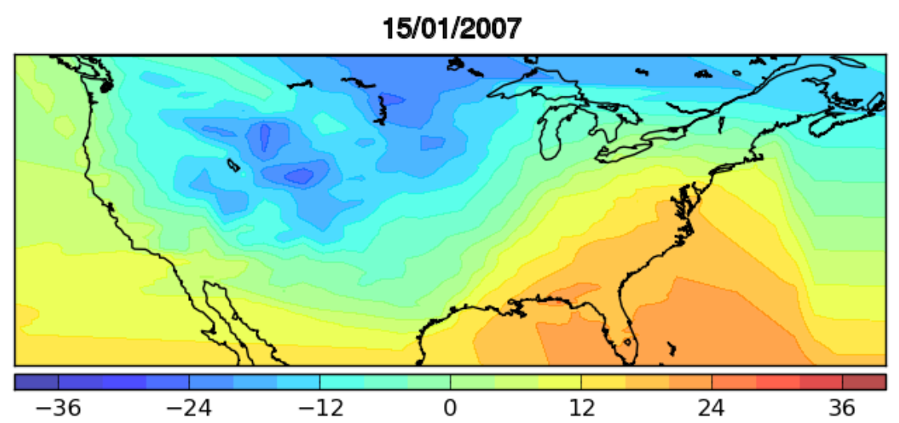

# TP : Évolution des températures aux États-Unis à partir des données NOAA


<iframe width="560" height="315" src="https://www.youtube.com/embed/57YIRuRHne0?si=rJrl3U-9tF3JFX2q" title="YouTube video player" frameborder="0" allow="accelerometer; autoplay; clipboard-write; encrypted-media; gyroscope; picture-in-picture; web-share" referrerpolicy="strict-origin-when-cross-origin" allowfullscreen></iframe>

**Cas pratique:** Nous allons utiliser une base de données météo disponible en ligne [http://www.ncdc.noaa.gov/orders/qclcd/](http://www.ncdc.noaa.gov/orders/qclcd/).

Cette base de données contient des archives de relevés météorologiques depuis 1996. Attention, nous utiliserons pour le moment uniquement les
données de 1996 à 2007 (le format des données a changé en 2007, on adaptera tout à la fin du sujet notre programme pour qu'il puisse gérer ce format légèrement différent). Nous souhaitons écrire un logiciel permettant de visualiser les évolutions de la température sur une période
donnée. Pour ce faire nous allons utiliser plusieurs des outils disponibles sous Unix~:

- zenity pour saisir les dates limites pour lesquelles effectuer le tracé,
- wget pour récupérer les archives de données à tracer,
- awk pour filtrer les enregistrements et n'extraire que les données à tracer,
- python et le module [basemap](http://matplotlib.org/basemap/users/examples.html) pour tracer effectivement les données sélectionnées,
- imagemagick pour post-traiter les images,
- ffmpeg pour générer une vidéo des images tracées précédemment,
- makefile ou bash pour encapsuler l'ensemble dans un script et qui gérera l'exécution de tous les processus précédents.

!!! note

	Les informations qui figurent dans les fichiers sont documentées ici [http://www.ncdc.noaa.gov/orders/qclcd/ExplanationOfCodes.htm](https://www.ncdc.noaa.gov/orders/qclcd/ExplanationOfCodes.htm)

!!! warning

	Malheureusement, avec les lois Anti Science et climatosceptiques de l'administration de D. Trump,
	certaines données sont supprimées ! Des initiatives courageuses ont vu le
	jour en vue de maintenir des miroirs. 

	En particulier, l'initiative [climate mirror](https://climatemirror.org/)
	qui permet de conserver des copies des données avant le passage de
	l'administration de D. Trump.

	Pour ce TP, nous utiliserons le miroir de ncdc.noaa.gov accessible à
	l'adresse
	[https://s3.ca-central-1.amazonaws.com/climate-mirror/index.html](https://s3.ca-central-1.amazonaws.com/climate-mirror/index.html)

	et en particulier le miroir du dataset qclcd :

	[https://s3.ca-central-1.amazonaws.com/climate-mirror/www.ncdc.noaa.gov/orders/qclcd/index.html](https://s3.ca-central-1.amazonaws.com/climate-mirror/www.ncdc.noaa.gov/orders/qclcd/index.html)


## Présentation du projet

Les données météo que nous allons utiliser sont disponibles en ligne et fournies par le National Climatic Center de la National Oceanic and Atmospheric Administration (NOAA). Les archives nommées AAAAMM.tar.gz contiennent les mesures pour le mois MM de l'année AAAA. Les archives de ces données (les .tar.gz) contiennent 5 fichiers. 

- station.txt : description des stations d'enregistrements (identifiant WBAN, latitude, longitude, etc..)
- AAAAMMhpd.txt : mesure des précipitations
- AAAAMMhourly.txt, AAAAMMdailyavg.txt, AAAAMMdaily.txt : mesures heure par heure ou journalières

Nous utiliserons par la suite uniquement les fichiers **station.txt** et **AAAAMMdaily.txt**. Les fichiers de mesures contiennent les mesures de température, force du vent etc.. et sont indexées par l'identifiant WBAN (*Weather-Bureau-Army-Navy*) de la station de mesure. Pour tracer la carte des températures en une date donnée, il faudra donc :

- récupérer l'archive mensuelle qui contient les mesures de cette date
- filtrer le fichier de mesure AAAAMMdaily.txt pour en extraire les mesures à la date souhaitée
- combiner ces mesures avec le fichier station.txt pour formater les données à fournir au script de tracé (voir plus bas)
- tracer ces données


Je vous propose la conception sur la figure ci-dessus. 

Prenons le temps de la comprendre. Nous souhaitons que l'utilisateur puisse préciser deux dates pour indiquer la période du tracé des mesures ([zenity](../outils/interface.md), va nous aider pour ça). Un module est alors en charge de générer la séquence des jours séparant ces deux dates limites (on utilisera un petit script awk et les commandes mktime et strftime). L'idée est ici de très tôt se coller au format du flux d'images que nous souhaitons produire en sortie (i.e. une image par jour) et de s'adapter ensuite au format des données. Ensuite, étant donnée une date, e.g. 01/06/2007, on se débrouille pour construire l'URL vers le fichier de données et le télécharger à l'aide de awk. On doit maintenant produire un fichier de données spécifique à la journée et aux données à tracer; on facilite ainsi les traitements suivants en excluant beaucoup de données inutiles et en faisant le boulot de la fusion des données géographiques sur les stations et des mesures à proprement parler. Arrivée là, on a quasiment terminé le travail. Il suffit de tracer les données météo et on utilisera Python et le module [Basemap](http://matplotlib.org/basemap/)) pour cela[^1]. On se retrouve alors avec une collection d'images qu'il nous suffit d'assembler à l'aide de ffmpeg. 

## Mise en place du projet

On va commencer par structurer notre répertoire de travail avec les répertoires et fichiers ci-dessous :

```
Meteo/
├─ data/
├─ images/
├─ videos/
└─ scripts/
```

!!! question

	**Définissez** un script bash `clean.sh` qui supprime tous les éléments des répertoires data, images et videos.

## Interface pour la requête - zenity

La première étape consiste à fournir à l'utilisateur une interface simpliste pour saisir les dates de début et de fin de la période à tracer. Comme on ne souhaite pas une interface très évoluée, on va faire appel à un outil très pratique, [zenity](../outils/interface.md). Commençons par voir ce que l'on peut faire avec zenity sachant que vous trouverez une liste complètes des éléments graphiques créables avec zenity dans le [manuel](https://help.gnome.org/users/zenity/stable/). 

Ici, on s'intéresse essentiellement à créer une boite de dialogue avec deux zones de texte pour saisir nos dates, quelque chose qui ressemble à la figure ci-dessous fera l'affaire.


Exécutez l'exemple ci-dessous. 

```bash
$ zenity --forms --text="Test" --add-entry="Une entrée"
$ zenity --entry --text="Test"
```

Saisissez un texte dans la zone de texte et validez. Vous observez alors que le texte que vous avez saisi s'affiche dans le terminal; le résultat de la commande est alors le texte que vous avez entré. On a déjà vu dans les TP précédents qu'il est possible d'exécuter des commandes depuis un script bash et grâce à zenity, vous pouvez même facilement ajouter des éléments graphiques (basiques, je vous l'accorde, mais ça nous suffit ici!). 

!!! question

	A l'aide de l'aide en ligne sur zenity, à vous de réaliser l'interface graphique dont nous avons besoin pour saisir nos deux dates. Celle de la figure ci-dessus contient un **formulaire** avec deux **entrées** texte et un **titre**. Pour des raisons pratiques pour la suite, ^^assurez-vous^^ que le **séparateur** est le caractère d'espace.


!!! question

	**Placez** l'appel à zenity dans un script bash que nous appellerons `get_date.sh`.


## Génération de la séquence de dates - python

Il nous faut maintenant, à partir de deux dates limites, produire la séquence des dates qui les sépare. Appelons ce script que nous aimerions écrire `generate_dates.sh`, et voyons ce que nous aimerions que ce script fasse.

```bash
$ echo "01/06/2007 15/07/2007" | ./generate_dates.py 
01062007
02062007
03062007
...
15072007
```

On aimerait donc produire une séquence de dates. Pourquoi ? Parce qu'on va définir un pipeline qui sera en charge de produire le flux d'images 01062007.png, 02062007.png, ..., 15072007.png. Comment faire ? Comment toujours, on a plusieurs solutions. Il en existe une avec [awk](http://stackoverflow.com/questions/4351282/how-to-generate-a-sequence-of-dates-given-starting-and-ending-dates-using-awk-of), elle est courte mais pas très rigolote. Je vous propose de voir, au détour de notre problème, l'utilisation de Python (ce sera notre première application de python et une autre suivra bientôt). La solution que nous allons proposer est, je trouve, beaucoup plus intelligible que la version awk.

On va donc faire un peu de Python. Pour faire du python, vous pouvez soit définir un script (i.e. un fichier texte dont l'extension est habituellement ".py") soit l'utiliser directement dans le terminal. Avant d'écrire un script qui va générer la séquence des dates, je vous propose de commencer par voir un peu de syntaxe Python directement dans l'interpréteur. Lançons python :

```bash
$ python
Python 3.10.12 (main, Feb  4 2025, 14:57:36) [GCC 11.4.0] on linux
Type "help", "copyright", "credits" or "license" for more information.
>>>
```

Pour manipuler les dates, il existe le module Python [datetime](https://docs.python.org/3/library/datetime.html). Pour importer ce module, il suffit d'utiliser la commande import :

```python
>>> import datetime
```

On peut maintenant instancier des objets du type datetime du module datetime. Par exemple, pour représenter le 01/06/2007 à l'aide d'un objet datetime, on utilisera le code ci-dessous (voir la [documentation](http://docs.python.org/3/library/datetime.html#datetime.datetime)) :

```python
>>> begin = datetime.datetime(day=1, month=6, year=2007)
>>> begin = datetime.datetime(2007, 6, 1)
>>> print(begin)
datetime.datetime(2007, 6, 1, 0, 0)

```

La première façon de construire un objet de type datetime utilise des arguments nommés, la seconde des arguments positionnels (voir la [documnetation](http://docs.python.org/3/glossary.html#term-argument)). L'un des avantages des paramètres nommés est de pouvoir les positionner dans l'ordre que l'on souhaite. 

Ce type datetime nous permet de manipuler des dates. Il fournit notamment des opérateurs pour incrémenter une date d'une durée (type [datetime.timedelta](http://docs.python.org/3/library/datetime.html#datetime.timedelta)) arbitraire, de les convertir en une chaîne de caractères avec un format déterminé, de vérifier si une date précède une autre date, etc... Voici quelques exemples :

```python
>>> nextday = begin + datetime.timedelta(days=1)
>>> nextday
datetime.datetime(2007, 6, 2, 0, 0)
>>> nextday = begin + datetime.timedelta(days=3994)
>>> nextday
datetime.datetime(2018, 5, 8, 0, 0)
>>> print(nextday.strftime("%d/%m/%Y"))
08/05/2018
>>> begin < nextday
True
>>> begin > nextday
False
```

Il nous manque encore quelques ingrédients pour pouvoir écrire notre script `generate_dates.py` :

- comment récupérer des arguments passés par l'entrée standard à un script python
- les arguments récupérés étant des chaînes de caractères de la forme dd/mm/YYYY, comment y extraire les entiers correspondants au jour, mois et année
- comment itérer entre deux dates

Pour récupérer les arguments passés à un script python, qu'on invoquerai `python script.py titi ttoto 12`, on utiliserait le module "sys" et son attribut, de type liste, sys.argv. Ici, nous allons procéder de manière un peu différente puisqu'on souhaite passer les arguments ^^par l'entrée standard^^, i.e. quelque chose du type :

```bash
$ echo "01/06/2007 15/07/2007" | ./generate_dates.py
```

J'ai ici utilisé echo pour avoir un exemple sous la main pour tester mais en pratique c'est votre script `get_dates.sh` qui nous fournirait dans la sortie standard les dates limites. En python, on peut lire directement de stdin[^2]}. Même si la syntaxe ci-dessous a l'air un peu compliqué, c'est à ma connaissance la seule qui garantisse que python ne bufferise pas ses entrées et les traite bien dés qu'elles sont émises par le script qui écrit dans son entrée standard. Un exemple de script python, que nous appellerons `test_stdin.py`, est donné ci-dessous :


```python
#!/usr/bin/python

import sys

while(True):
    l = sys.stdin.readline()
    if(l == ''):
        break
    sys.stdout.write("[test_stdin.py] a lu %s " % l)
```


!!! question

	Prenez vous un fichier texte, appelons le monfichier et testez le script ci-dessus :

	```bash
	$ cat monfichier | ./test_stdin.py
	```

Testons le maintenant avec le type d'entrée qu'il va recevoir :

```bash
$ echo "01/06/2007 15/07/2007" | ./test_stdin.py
```

Maintenant, il va falloir travailler un peu la ligne lue puisque je vous rappelle que nous devons récupérer des entiers correspondants au jour, mois et année des dates de début et fin. Ce qu'on cherche essentiellement à faire, c'est diviser les chaînes de caractères pour :

1. isoler la date de début de la date de fin
1. extraire les éléments de chacune des dates. 

Testez les exemples ci-dessous :
```python
>>> l = "01/06/2007 15/07/2007".split()
>>> print(l)
['01/06/2007', '15/07/2007']
>>> begin=l[0].split("/")
>>> print(begin)
['01', '06', '2007']
>>> dd=int(begin[0])
>>> mm=int(begin[1])
>>> yyy=int(begin[2])
```

!!! question

	Vous disposez maintenant de tous les éléments pour écrire le script python `generate_dates.py`. A vous de jouer.

	Testez le :
	```bash
	$ echo "01/06/2007 15/07/2007" | ./generate_dates.py 
	01062007
	02062007
	03062007
	...
	15072007
	```

	Et bien sûr, testez également le pipeline :

	```bash
	$ ./get_dates.sh | ./generate_dates.py 
	```

## Téléchargement, extraction et filtrage des données - tar wget grep awk sed

Maintenant que nous disposons d'un générateur des dates (`generate_dates.py` produit la séquence des dates dans la sortie standard), nous pouvons gérer la partie qui consiste à télécharger les données nécessaires au tracé. Nous allons écrire ce script en Bash. 

Vous vous rappelez que nous disposons de données journalières au sein d'une archive mensuelle. Par exemple, l'archive "200706.tar.gz" contient toutes les données pour tous les jours du mois de juin. Il faut donc que notre script de téléchargement/extraction fasse plusieurs choses, étant donnée une date d'entrée :

- vérifie si l'archive du mois de la date est pas déjà téléchargée. Si elle ne l'est pas, on la télécharge, on l'extrait dans le répertoire data (et on renomme le fichier station pour lui ajouter le préfixe YYYYMM)
- filtre le fichier de données pour construire un fichier de données spécifique à la date qui nous intéresse.

**Génération des noms des archives:**

Commençons par le premier point. Les dates vont être fournies par l'entrée standard à notre script `get_data.sh`. Il faut extraire ce que nous lisons de l'entrée standard (e.g. 01062007) le jour, le mois et l'année. En bash, on peut extraire des sous-chaînes d'une chaîne `s` par l'appel `${s:debut:longueur}`, par exemple:

```bash
$ date="01062007"; echo "Day : ${date:0:2}"
Day : 01
```

!!! question

	Complétez votre script `get_data.sh` pour qu'il construire la chaîne de caractère correspondant à l'archive dans laquelle se trouve les données d'une journée. Par exemple, pour le 01/06/2007, cela doit donner 200706.tar.gz.

	Assurez vous du bon fonctionnement de votre script :

	```bash
	$ echo "01062007" | ./scripts/get_data.sh
	```

### Récupération des données brutes d'une journée:

Maintenant que nous disposons du nom de l'archive, e.g. 200706.tar.gz, on va d'abord vérifier si le fichier local `Data/200706.tar.gz` existe déjà, sinon on le récupère[^3]. En bash, pour vérifier si un fichier existe, on utilise le test conditionnel "if [ -f filename ]", par exemple :

```bash
#!/bin/bash

echo "Ce script teste l'existence d'un fichier passé en argument"

if [ $# != 1 ]
then
    echo "Vous devez passer un fichier en argument"
    exit
fi

if [ -f $1 ]
then
    echo "Le fichier $1 existe !"
else
    echo "Le fichier $1 n'existe pas !"
fi
```

!!! question

	Complétez votre script `get_data.sh` pour qu'il teste si l'archive recherchée est déjà disponible en local et sinon la télécharge (souvenez vous de la commande wget utilisée dans le premier TP).

**Extraction des données pertinentes**

L'archive que nous venons de télécharger est une archive ".tar.gz". Pour l'extraire, nous utilisons l'outil [tar](../outils/archive.md) :

```bash
tar -zxf monarchive.tar.gz
```

Que signifient ces options[^4]? "-x" signifie qu'on extrait (on pourrait aussi créer une archive avec "-c"), "-f" signifie qu'on utilise un fichier (on peut (dé-)compresser l'entrée standard :) ) et "-z" qu'on compresse avec gzip (il existe d'autres méthodes de compression).

On peut même faire mieux en spécifiant quels fichiers nous souhaitons extraire de l'archive. En effet, nos archives contiennent plus de fichiers que nécessaires et nous ne voulons en extraire que les fichiers xxxxdaily.txt et station.txt. Il suffit de le spécifier sur la ligne de commande :


```bash
tar -zxf monarchive.tar.gz monfichier1.txt monfichier2.txt chemin/vers/monfichier3.txt

```


Vous savez maintenant comment extraire les deux fichiers "station.txt" et "xxxdaily.txt". 

On va réaliser une dernière opération sur le fichier station.txt qui consiste à en extraire uniquement les données de WBAN, latitude et longitude. A l'aide de awk, extrayez les 3 champs pertinents et redirigez la sortie de votre appel awk dans le fichier xxxxstation.txt avec xxxx un prefixe de la forme YYYYmm. Vous pourrez alors également supprimer le fichier station.txt et l'archive xxxx.tar.gz.

### Filtrage des données pertinentes du fichier daily: awk, sed, join

Pour pouvoir effectuer notre tracé des températures sur le territoire américain, il nous faut plusieurs choses: les températures et les positions géographiques des enregistrements. Les fichiers xxxxdaily.txt contiennent énormément d'informations, dont un grand nombre est inutile pour notre application. Les stations d'enregistrement dans les fichiers xxxxdaily.txt sont indexées par leur WBAN mais la position géographique d'une station est quant à elle disponible dans le fichier xxxxstation.txt que nous venons de créer. Il nous faut donc extraire uniquement les températures et les WBAN du fichier xxxxdaily.txt et combiner cela avec le fichier de station. Nous allons pour cela utiliser plusieurs outils en un pipeline. 

Si vous inspectez un fichier xxxxdaily.txt, vous pouvez remarquer que, parfois, la température est égale à 'M' ou '-' correspondant à une valeur invalide, parfois elle est suffixée par une étoile; on aimerait supprimer les entrées invalides et supprimer les "*" suffixant certaines températures; définissions un pipeline avec :

- `awk` pour extraire uniquement les WBAN et températures moyennes de la date considérée,
- `awk` pour supprimer les entrées pour lesquelles la température est égale à "M" ou '-', ce qui correspond à une entrée invalide,
- `sed` pour substituer les "*" par un caractère vide "".

Enfin, utilisez `join` pour combiner les données ainsi générées avec le fichier xxxxstation.txt. join peut prendre deux fichiers en argument pour les combiner mais il accepte également qu'on remplace un des fichiers par l'entrée standard en précisant "-" comme nom de fichier; voyons quelques exemples :

```bash
$ cat toto.txt
a a1
b b1
c c1

$ cat titi.txt
a a2 a3
b b2 b3
c c2 c3

$ join toto.txt titi.txt
a a1 a2 a3
b b1 b2 b3
c c1 c2 c3

$ cat toto.txt | join - titi.txt
a a1 a2 a3
b b1 b2 b3
c c1 c2 c3

```

L'intérêt de la dernière commande est de pouvoir mettre l'appel join dans un pipeline pour combiner à la volée l'entrée standard avec un fichier. Vous devriez maintenant avoir tous les éléments pour produire un fichier de données qui contiennent les WBAN, longitudes, latitudes et températures moyennes mesurées. Par exemple, vous devriez pouvoir produire le fichier 01062006.txt ci-dessous en invoquant votre script `get_data.sh`.

```bash
$ cat Data/01062006.txt
03013 38.04 -102.41 67 
03016 39.32 -107.44 64 
03017 39.50 -104.4 63 
03024 35.42 -101.23 73 
03026 39.14 -102.17 62
03027 35.00 -105.4 63 
03028 37.17 -102.37 66
....
```

!!! question

	A vous de jouer et finalisez votre script `get_data.sh`


## Tracé des données - python

Il nous reste maintenant à effectuer le tracé des données extraites. On va partir d'un fichier de données exemple comme Data/01062006.txt. Les mesures sont ponctuelles et nous aimerions les interpoler sur tout le territoire. Nous aimerions également tracer ces données sur une carte du territoire américain. Pour cela, nous allons utiliser Python et ses modules `scipy` pour l'interpolation et `basemap` pour le tracé des cartes. Nous allons procéder par étape~:

- tracer la carte,
- récupérer les données brutes et les tracer sur la carte,
- interpoler ces données sur une grille et tracer les données interpolées,
- limiter le tracé aux terres.

### Tracé de la carte

Pour tracer la carte du territoire américain, nous utilisons le module [basemap](http://matplotlib.org/basemap/). Inspirez vous du script d'exemple de basemap sur [https://matplotlib.org/basemap/stable/users/cyl.html](https://matplotlib.org/basemap/stable/users/cyl.html) sur les coordonnées cylindriques pour effectuer un tracé du territoire américain. Un exemple de tracé est représenté ci-dessous.


### Tracé des données brutes

La deuxième étape consiste à importer les données précédemment filtrées et à les tracer sur la carte. Pour charger des données d'un fichier texte, organisées en colonnes, le plus simple est d'utiliser la fonction [loadtxt du module numpy](https://numpy.org). Le script ci-dessous vous montre un exemple d'utilisation :

```python
#!/usr/bin/python
# coding: utf-8

import sys
import numpy as np
import matplotlib.pyplot as plt

print("Je teste le chargement de données")

if(len(sys.argv) != 2):
    print("Usage : {} datefile".format(sys.argv[0]))
    sys.exit(-1)

# On recupere le chemin vers les donnees
datafile=sys.argv[1]

# On les charge
data = np.loadtxt(datafile)

# Et pour rigoler, on trace les temperatures
plt.figure()
plt.plot(data[:,3])
plt.title("Températures moyennes (deg K)")
plt.show()
```

Ces données forment un ensemble non structuré de points; pour les tracer, nous utilisons ce qui s'appelle un **scatter plot**. Mais, pour correctement tracer les données, il faut d'abord projeter les longitudes et latitudes des points de mesure sur la carte. L'object Basemap que nous avons construit lors du tracé de la carte peut être appliqué à des vecteurs de longitudes et latitudes pour calculer leur projetés.

```python
# On suppose que data est un vecteur à 3 colonnes
# data[:,0] contient les longitudes
# data[:,1] contient les latitudes
# data[:,2] contient les températures

m = Basemap(projection='cyl',
            llcrnrlat=25,urcrnrlat=50,
            llcrnrlon=-130,urcrnrlon=-60,resolution='l')

x, y = m(data[:,0], data[:,1])
fig = plt.figure()
m.drawcoastlines()
plt.scatter(x, y, c=data[:,2])
plt.show()

```

!!! question

	Faites maintenant le tracé des mesures brutes. N'oubliez pas de convertir les températures en degrés Celsius. Vous devriez obtenir quelque chose comme la figure ci-dessous pour le 1$^{er}$ juin 2006.

	

## Interpolation

Il nous faut maintenant interpoler les données brutes pour estimer les températures sur tout le territoire. Il existe plusieurs algorithmes d'interpolation fournis par le module [scipy](https://docs.scipy.org/doc/scipy/reference/interpolate.html). Nous allons utiliser la fonction `griddata` pour interpoler en 2D à partir de données non-structurées. Vous trouverez un exemple d'utilisation dans la [documentation de griddata](http://docs.scipy.org/doc/scipy/reference/generated/scipy.interpolate.griddata.html#scipy.interpolate.griddata). 

!!! question

	Adaptez cet exemple pour interpoler les données météo sur une grille de $100\times 100$ points. Quelques exemples de résultat sont illustrés sur la figure ci-dessous.

	
	


## Et finalement....

Il reste maintenant à intégrer tout ce qu'on a vu pour le tracé des données dans un script `plot_temperatures.py`. Pour cela, il nous manque encore quelques éléments, à savoir :

1. lire dans l'entrée standard, depuis Python, un fichier de données,
1. sauvegarder l'image générée par python. 

Pour sauvegarder l'image depuis Python, c'est relativement simple, il suffit d'appeler savefig de la manière suivante :

```python
plt.savefig(output_filname, bbox_inches='tight')
```

L'option "bbox_inches='tight'" garantie que la *bounding-box* de l'image colle au mieux aux éléments graphiques.

Et pour ce qui est de lire des éléments de l'entrée standard, voici un exemple
en python :

```python
import sys
import os

count = 0

while(True):
    line = sys.stdin.readline()
    if(line == ''):
        break

    # On supprime le passage à la ligne à la fin de la ligne lue
    datafile = line.rstrip('\n')

    filename = os.path.basename(datafile)
    output_filename = "Images/%05d.png" % count

    .... on fait le tracé ....

    plt.savefig(output_filename, bbox_inches='tight')
    count = count + 1
```

## Incruster la date et générer la vidéo - imagemagick, ffmpeg

Pour terminer, il reste à incruster la date dans les images et à générer une vidéo à partir des images que vous venez de produire. Comme pour le TP sur le soleil, nous utiliserons imagemagick et ffmpeg. On attendra également que toutes les images soient produites avant d'exécuter ffmpeg.




## Gérons les fichiers de données au delà de Mai 2007

Il n'y que peu de modifications à apporter au pipeline pour pouvoir gérer les fichiers de données au delà de mai 2007. En pratique, il y a :

1. le nom de l'archive qui change,
1. le nom du fichier station dans l'archive. 

Pour adapter votre programme, je vous suggère : 

- de modifier `generate_dates.py` pour qu'il émette deux éléments dans la sortie standard, à savoir la date à laquelle l'image doit être générée et un mode (0 ou 1) qui indique si la date demandée précède ou non mai 2007 (les objets de type datetime en python savent se comparer),
- de modifier `get_data.sh` pour qu'il capture les deux entrées transmises par `generate_dates.py`. En fonction du mode il faudra télécharger et gérer les archives différemment.

Sachez que vous pouvez, tout comme pour une archive .tar.gz, extraire un seul fichier d'un fichier zip :

```bash
$ unzip -p monarchive.zip monfichier1.txt > monfichier1.txt
$ unzip -p monarchive.zip chemin/vers/monfichier2.txt > monfichier2.txt
```

Enfin, si plusieurs arguments sont passés dans l'entrée standard d'un script bash, on peut facilement les extraire de la manière ci-dessous : 

```bash
#!/bin/bash

while read -r input
do
    inputarray=($input)
    echo "${inputarray[0]} ; ${inputarray[1]}"
done
```
```
$ echo "titi toto" | ./stdread_multi.sh 
titi ; toto
```


[^1]:
	On peut faire des tracés très sympa avec basemap!!

[^2]:
	on peut même itérer sur le descripteur de fichier sys.stdin, mais cette approche bufferise la lecture...

[^3]:
	En pratique, on pourrait être un peu plus malin. On ne va retenir qu'une partie des données de l'archive. L'archive est grosse. On pourrait donc vérifier si les données extraites et retenues de l'archive sont déjà présentes

[^4]:
	n'hésitez pas à aller jeter un oeil au manuel:  `man tar`
